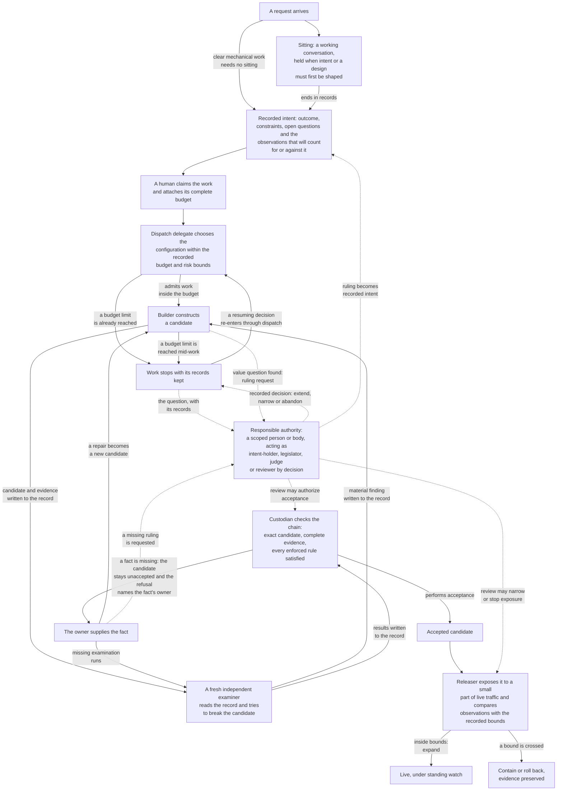
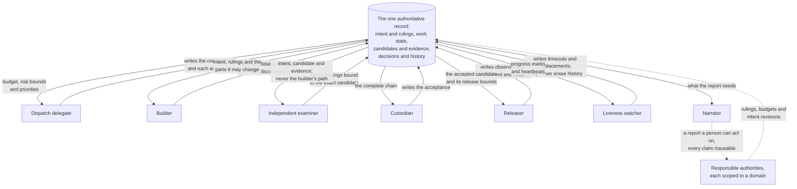
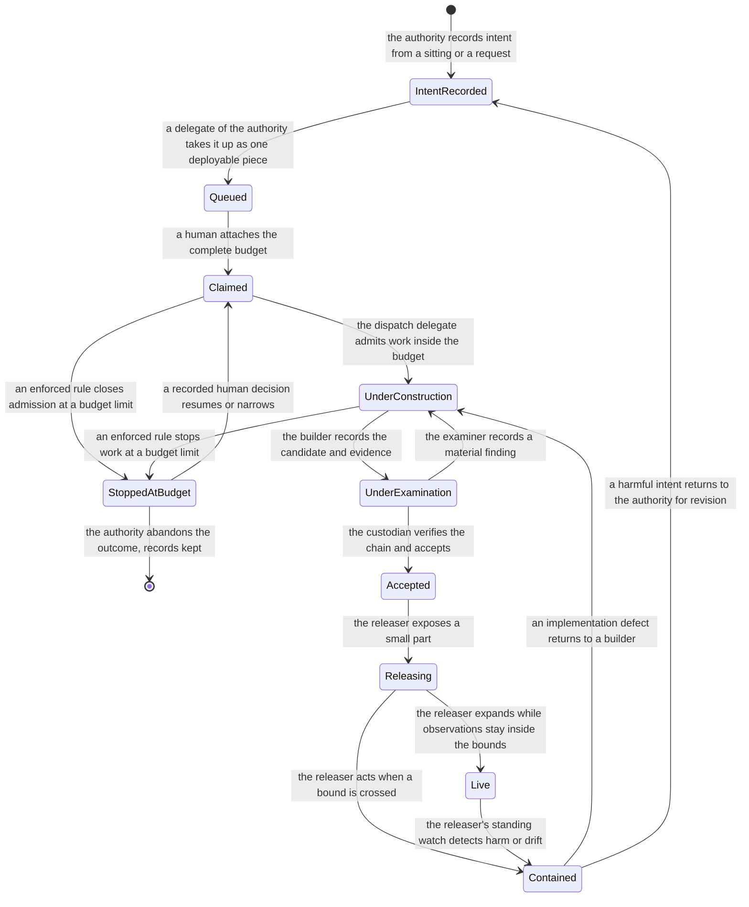
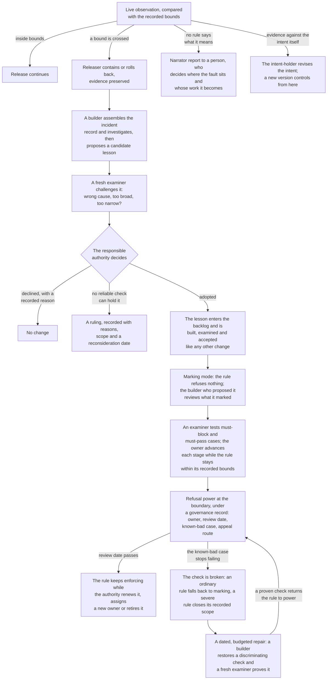
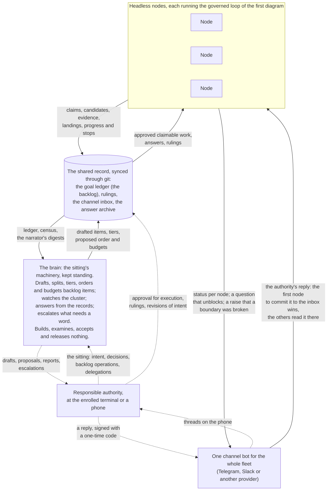
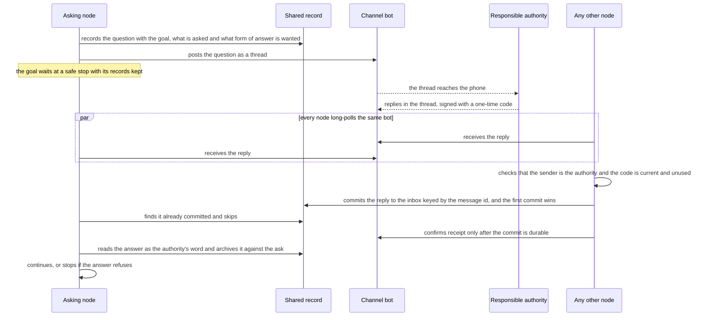
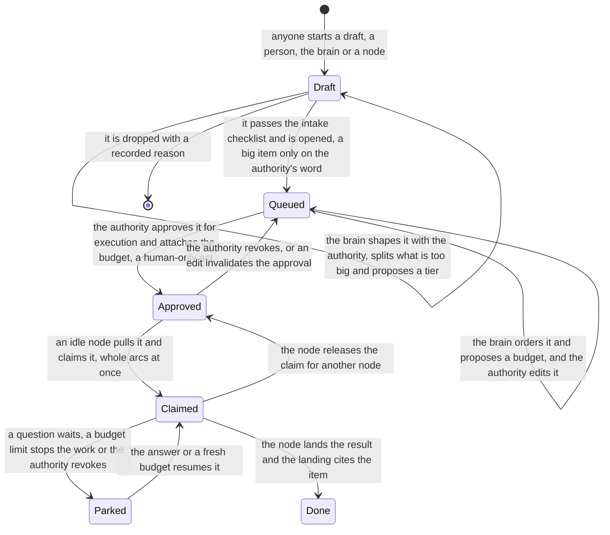

# Appendix: How the Metasystem Works

**Seven pictures of one system: how work moves, how records hold it together, who may move it, how it learns, and how a fleet of headless machines runs it with one brain and one channel.**

This appendix draws the paper's functional design. A reader should be able to follow how the metasystem works with people from these seven diagrams and their descriptions alone, without the seventeen chapters. The vocabulary is the paper's; the closing section says where the accompanying software's names and reach differ today, because the paper's design goes beyond what the software currently does.

Two conventions hold in every diagram. Solid arrows carry the work forward, and the work travels as records: each stage writes what it did and the next stage reads it, so nothing authoritative depends on a private conversation between actors. Dashed arrows are exchanges with people: questions going to a person, reports written for a person and the decisions a person records.

A few terms carry the whole appendix. A candidate is a version of a change that still has to be judged. An enforced rule is a rule with the power to refuse an action at the moment it happens, when a required fact is missing; its refusal names the fact. A budget is the recorded limit a human attaches before work starts, and it is complete: how long, how many attempts, how much machine time, how much at once. Four risk questions set how much evidence and spending a change deserves: how severe the harm could be, how unfamiliar the approach is, how many users or systems it can reach and how much change has accumulated since the last broad look. And recorded intent holds more than a wish: the outcome, its constraints, the open questions, the freedoms left to construction and the observations that will later count for or against it in production.

## One change, end to end

The first diagram follows one consequential change from a request to live behavior. Read it top to bottom. A sitting is held only when intent or a design must first be shaped; mechanical work with clear intent skips it. The budget is attached by a human when the work is claimed, and reaching any of its limits, before construction or in the middle of it, is a stop, never a nudge: the work keeps its records and waits, and only a recorded human decision extends, narrows or abandons it. Each examination round uses a fresh examiner, one that never saw the builder's path, and whoever helped shape the design in a sitting is disqualified from examining it. A human reviewer, independent of construction, may demand more evidence, may narrow or stop exposure through the releaser and may authorize acceptance; the custodian is still the actor that performs acceptance, and only after every required fact is present. When a fact is missing, the custodian does not send the work anywhere: it leaves the candidate unaccepted, and the refusal names the fact so its owner can supply it, whether that owner is a builder, an examiner or the authority itself. This picture shows the full configuration a consequential change deserves; a small, low-risk change staffs fewer actors while the same protections hold at the boundaries.

## Records hold the roles together

The second diagram shows the working roles around the one authoritative record. This is the system's coordination: each role reads only the view its task needs, writes what it did and never depends on a conversation with another role, while the full history stays preserved for recovery and audit. Any of these roles can be held by a person or by machinery under the same permissions; what the diagram fixes is the role's reach, not the kind of worker in it. The examiner's view is the deliberate one: it receives the intent, the candidate and the evidence, never the builder's path of discarded attempts, because that path is the framing it must challenge. Two standing observers live here as well. The liveness watcher tells a stopped worker from a slow one and may replace it, but may never erase why it stopped. The narrator turns the record into the one output written for people; it changes nothing, and every claim in its report stays traceable to the record it came from.

## The states of a change and who may move it

The third diagram is the paper's conceptual lifecycle of one change. It is not a single machine inside the software; the closing section maps the software's own state records onto it. Every transition is a recorded act, bound to the actor and evidence behind it. Four boundaries carry more than that: acceptance, release, expansion and the budget stop each stand under an enforced rule that refuses or halts when a required fact is missing or a limit is reached, and the refusal names what happened. The separations show in the labels: the actor that builds never appears on an accepting arrow, the actor that accepts never builds or examines, and an implementation defect found after containment returns through construction and a fresh examination, never around them. Containment can also reveal a fault that is not the implementation at all: a check that proved too weak, a release bound set wrong or an intent that harms the people it governs, and each of those returns to its own owner, the last one to the authority as an intent revision. There is no final state after Live on purpose: the watch stands for as long as the intent's conditions do, and care continues.

## How the system learns

The fourth diagram shows the return paths that make one failure change future behavior. An observation that no rule can interpret goes to a person through the narrator's report, and the person decides where the fault sits: the implementation, a weak check, a wrong bound or the intent itself, each with its own owner. After containment, a builder assembles the incident record and investigates, keeping what was observed apart from what is suspected, and proposes a candidate lesson. The lesson is challenged before anyone acts on it. The authority then has three honest outcomes: decline with a recorded reason, keep the lesson as a ruling when no reliable check can hold it, or adopt it. An adopted lesson earns its power slowly. It enters the backlog and is built, examined and accepted like any other change. It runs first in marking mode, where it refuses nothing and the builder who proposed it reviews what it marked. An examiner then tests it with changes it must block and changes it must pass, and its owner advances it through staged activation, one step at a time, only while it behaves within its recorded bounds. Full power comes with a governance record naming the rule's owner, review date, known-bad case and appeal route, and the two ways a rule degrades part ways: a passed review date leaves a working rule enforcing until a recorded decision renews or retires it, while a known-bad case that stops failing means the check itself is broken, so an ordinary rule falls back to marking, a severe rule closes its recorded scope and either way a dated, budgeted repair record opens. One rule governs all of this when the change is to a rule itself: the current rules, the retained known-bad cases and the current authority judge the proposed replacement. A rule change never judges its own adoption. And when live evidence shows the intent itself is wrong, the return is not a rule at all: the intent-holder revises the intent, and a new version controls from then on.

## The fleet: headless nodes, one brain, one channel

The first four diagrams show one change on one machine with a person at the keyboard. The design's target is a fleet. Several headless machines, the nodes, each run the governed loop of the first diagram with no session on top. One brain works with the responsible authority. One channel carries the fleet's messages to the authority's phone and the authority's answers back. The fifth diagram shows how the four connect; the software calls the seat "the brain" as a working name.

Three things fix the shape. The nodes' scope is exactly backlog to candidate to release. They send two kinds of message, a question that unblocks and a raise that a boundary was broken, and they keep working the approved queue when the brain is down, because they proceed on rules and records, not on instruction. The brain builds, examines, accepts and releases nothing, and in its first form may not dispatch either. It is the sitting's machinery kept standing: the narrator with judgment and a hand on the queue. It drafts backlog items from the authority's words and from what the nodes report, splits what is too big, proposes a tier, a budget and an order, watches which node runs what and who is stuck, answers what the records can answer and escalates only what needs the authority's word. Approval for execution is the one act only the authority performs. Under a recorded power of attorney, the Chapter 13 delegation with a named decision class, a review date and a revocation route, the brain may take decisions of that class, and each one is logged against the row it rests on. The separations hold at the actions, not in anyone's conduct: a claim refuses a goal no human approved, and approval needs proof that a human gave it, from the terminal they enrolled or by a verified word over the channel.

## A question's path through the channel

The sixth diagram follows one message from a node to the authority and back. Every provider fixes one fact: one bot has one reader, and a message read by one machine is gone for the others. The fleet does not answer that with a leader that could die. Every node reads the same bot, and the first node to commit an inbound message to the shared inbox wins; the others find it committed, keyed by the provider's message id, and skip. A node confirms receipt to the provider only after its commit is durable, so a node that dies between reading and committing has confirmed nothing and the message is delivered again. The node that committed the reply checks two things first: that the sender is the authority's account and that the one-time code the authority typed is current and unused. The asking node then reads the answer from the inbox, records it as the authority's word against the ask and the goal, and continues or stops as the answer says. The inbox is the working queue; the answer archive is the durable memory of everything the authority ever said. While the question waits, the goal that raised it sits at a safe stop with its records kept, and every other node keeps working the approved queue.

## The backlog states and who may move them

The seventh diagram is the shared backlog as a state machine, and the authority boundary is the one transition that matters most. An item begins as a draft: a free-form note with no grammar and no budget, started by a person, the brain or a node that found work. Drafting is where the brain does most of its work with the authority: it turns words into an item that says what done looks like, splits what is too big and proposes a tier. A draft enters the queue when it passes the intake checklist, and a big item enters only on the authority's word. The brain orders what is queued, and only the authority moves an item to approved, which is the moment the budget attaches. That act is human-only by construction: the verb works from an enrolled terminal or through the channel with a verified code, and an edit to an approved item invalidates the approval, because what was approved is the item as it read then. An idle node pulls approved work by itself, whole arcs at once, so fleet liveness is machinery's duty and never a human's memory. A budget stop, a question or a revocation parks the claim at the next safe point, and a fresh budget or the answer resumes it. The landing cites the item, and the item is done. The brain proposes every step of this and performs none of the reserved ones.

## Where the software stands today

The diagrams draw the design; the software holds part of it, in its own vocabulary. The goal ledger is the recorded intent, the backlog and the budget in one place: a goal is queued, claimed with the complete budget, parked or done, and the budget's four limits are elapsed time, attempts, reserved machine minutes and concurrent jobs. Reaching most limits closes further admission while running work finishes; an elapsed-time breach stops live work. Resuming needs a fresh complete budget from a human. Delegate jobs are the machine workers, with their own setup, running and terminal states, and a critic chain is the independent examination. Dispatch fixes the minimum examination duty from a declared hazard class. The three classes name what kind of wrongness the work could carry: purely mechanical work, work that carries design and work that can reach live data destructively. The class sets the required roles, while the four risk questions remain the judgment behind budgets and depth. The chain's closure gate refuses to close work whose required examination is missing, stale or performed by a session that saw the builder's path; it binds that evidence to the final round of work, not yet to an exact candidate tree. Closure is custody of evidence; it is not the custodian's acceptance and not a release, and the ordinary landing of a change does not yet consume a closed chain, a gap with queued backlog work against it.

The other gaps matter as much. Bounded release, production observation against intent conditions and the care machinery are the design's direction; the software does not hold them yet. The coordinator seat today combines dispatch, custody of landing and reporting in one actor, exactly the configuration Chapter 7 warns about, so until the queued guards land, that separation holds by conduct rather than at the actions. Liveness watching exists as supervision, and the narrator exists as reports and digests. The fleet half stands partly. The channel exists for Slack, with a fake provider for tests and a Telegram adapter; questions and replies travel as threads, and a reply is verified by a one-time code. The approved state and the human-only approve verb are on main, so a claim on an unapproved goal is refused today. The spend fence measures tokens and alerts at a ceiling but does not yet refuse. The tier is derived at intake. Not yet built: the one gateway and shared inbox for the whole fleet, so each machine still reads the bot with its own cursor and polls only when asked to; the first headless run, paused before the runner started; the pull by which an idle machine takes approved work; the answer archive; and the brain itself, queued, with its first form a session on one machine that holds the channel, the ledger and the census and is forbidden to dispatch. Where a diagram and the software disagree, the diagram shows the design the software is being built toward.
