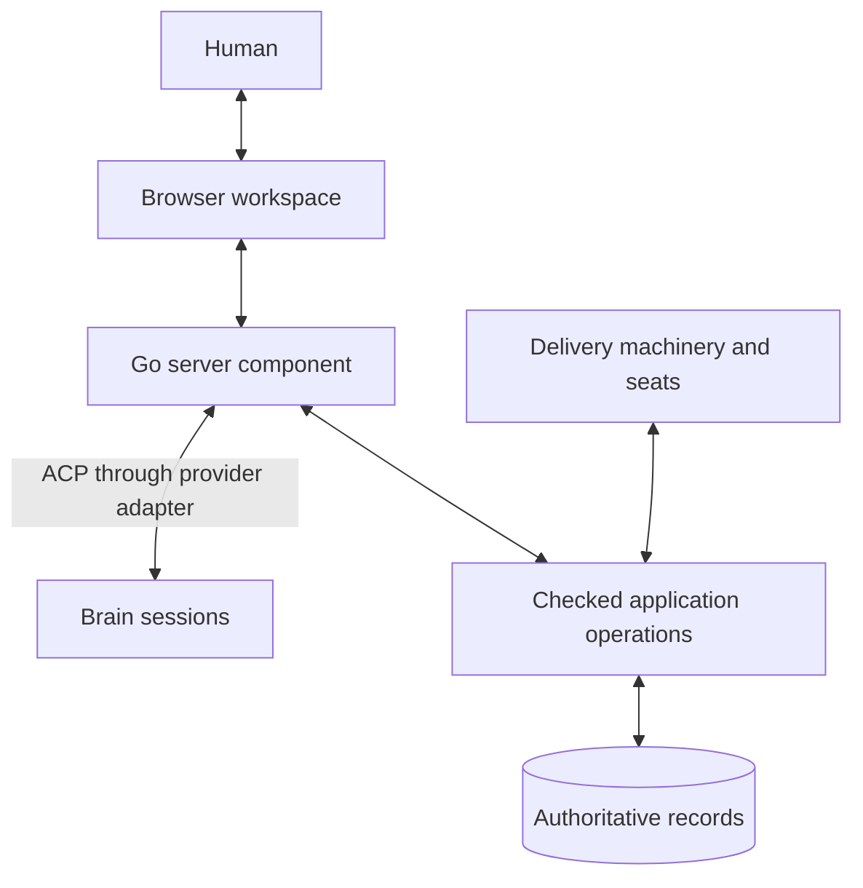

# User Interface Design

- Kind: design
- Id: 01M348YTJ290F6VMX6TWV1M1WZ
- Status: accepted
- Goals: browser-interface

Status: Interface structure, core interactions, and the shared-operation approach for conversation and visual controls are confirmed by the human. The round-one critique has been adjudicated and the structural backend requirements below added; those amendments had an independent [second review](../user-interface-design-critique-r2.md) and two design reviews by Astra on 2026-09-21, the [first](../user-interface-design-critique-astra.md) on the amendments and the [second](../user-interface-design-critique-astra-r2.md) on how they were applied and on the decisions taken after it. The findings the planner agreed with, each checked against the source along its whole chain, are applied below; [how each was disposed](../user-interface-design-critique-r2.md#dispositions-after-the-astra-review) is recorded with the second review. This document does not authorize implementation or execution. See [critique dispositions](../user-interface-design-critique-dispositions.md) for every finding, decision, and reason.

Human authority decision, 2026-09-21: successful sign-in grants human authority in this application. The server distinguishes signed-in human actions from agent actions; ordinary review and confirmation record what the human chose. This replaces the earlier browser-enrollment and per-action code proposal.

Human implementation decisions, 2026-09-21: the server and all application logic are Go, shipped as the one `metasystem` executable, which contains everything it needs at run time; images, fonts, HTML, JavaScript, and other resources are bundled into it. The browser interface is built with React. An npm toolchain may build it, and none is part of the deployed runtime; the built bundle is committed so that every build of the executable is complete. Everything that makes up the interface lives inside the `metasystem/` source folder, not at the host repository root. The interface server is its own process, started and stopped with `metasystem ui start` and `metasystem ui stop`; restarting the MetaSystem neither restarts it nor requires restarting it, and restarting it onto a new build is one command. Before sign-in exists, the read-only first gate needs no access token and relies on loopback binding with Host, Origin, and fetch-site validation. The human also instructed: follow the planner's recommendations and build the simple case first. Slices, their order, their state, and the findings behind the gate-table amendments of this date are in the [implementation plan](../user-interface-implementation-plan.md). The human also decided that the interface distinguishes clearly between building the MetaSystem itself with the MetaSystem and building another application with it; see [Workspace identity](#workspace-identity-the-subject-and-the-machinery).

## Purpose

Provide the primary human interface to the MetaSystem through a browser connected to a server component in the Go application.

The interface lets a human discuss the application with an agent, understand work underway, develop intent and designs, examine evidence, and make recorded decisions. The agent connects to the Go application through ACP. Claude, Codex, and Devin are candidate providers; their required capabilities and adapter support need verification before implementation commits to interchangeability.

The interface should become the place where the human naturally thinks about the application and directs its development. Conversation, inspectable records, and explicit decisions belong in the same workspace. It must support the complete set of human activities currently exposed through commands, including uncommon maintenance and recovery, without requiring the human to remember verbs or leave the browser to type them.

Direct manipulation and conversation are equal ways to work. The human can define goals, split them, plan slices, revise an agent's proposal, inspect evidence, and operate the fleet directly. The brain assists with these activities through the same underlying operations; asking it to execute a command is not the only way to use a feature.

## Agreed interface structure

The navigation follows the human's questions about the project. Each section has a distinct responsibility:

| Section | Main contents | Human question |
| --- | --- | --- |
| Brain | The primary conversation workspace, current sitting, shared context, and agent actions; permanently accessible across all sections | Can we discuss or work on what I am seeing? |
| Overview | Changes since the last visit, decisions needing attention, work and fleet summaries | What matters now? |
| Project | Intent, architecture, designs, constraints, success criteria, open questions, and sittings | What are we building, and why? |
| Backlog | Goal definitions, Kanban board, outline, dependencies, splits, slices, and execution detail | What should happen next, how is it divided, and how far has it progressed? |
| Fleet | Registered seats, active sessions, delegates, execution health, and capacity | Who is doing what, and is execution healthy? |
| Decisions | Pending questions, rulings, approvals, delegated authority, and affected subjects | What needs a human choice, and what was decided? |
| Application | Implemented and released behavior, observations, and links to supporting evidence | What does the application actually do? |
| Settings | Providers, connections, identity, execution defaults, and storage; accessed separately in the application shell | How is this workspace configured? |

Four layout decisions organize the detailed design:

1. **The brain has a permanent, primary place.** A fixed Brain entry opens the conversation workspace; the same conversation can stay docked beside every application view. The human and agent share explicit context and can work on the selected subject together. See [The embedded agent workspace](#the-embedded-agent-workspace).
2. **The board shows progress; the outline supports planning.** They present the same backlog. The human can move between them to define goals, split outcomes, plan slices, and follow execution without maintaining separate plans. See [Backlog: definitions and planning](#backlog-definitions-and-planning).
3. **Every goal has one consistent workspace:** Summary, Definition, Plan, Execution, Evidence, and History. The board, Fleet, and Decisions all lead to that same workspace and its original records. See [Backlog item detail](#backlog-item-detail).
4. **Revisions explicitly change future work and preserve history.** Before applying a revised split or slice plan, show what changes, what completed work remains useful, which seats are affected, and which approvals need renewal. Keep earlier plans and their evidence accessible. See [Revise a split or plan after work has started](#revise-a-split-or-plan-after-work-has-started).

The Brain entry sits above the project sections and remains visible when its dock is collapsed. It is the same agent workspace everywhere, with a focused conversation view and a docked view rather than a different chatbot for each section. Human editing and agent actions use the same records and operations. [Complete human operations through the interface](#complete-human-operations-through-the-interface) defines the requirement that routine work, exceptional decisions, maintenance, and recovery all have usable browser flows.

The agreed mixed visual and conversational interaction uses shared application operations and normal result views. An agent action returns its actual result and affected records; the frontend refreshes or opens their existing views. A single optional `present(resultID)` signal distinguishes a requested inspection from supporting reads. It uses the existing tool/result path and grants no general browser control. Richer visual guidance is deferred unless existing frontend facilities suffice. See [Implementation of the shared interaction](#implementation-of-the-shared-interaction) for the one shared interaction contract.

## Basis in the paper

The design develops concepts already described in the paper:

- [The Sitting](../../metasystem/docs/paper/15-the-sitting.md): a working conversation that produces recorded facts, decisions, designs, and open questions.
- [The fleet and its brain](../../metasystem/docs/paper/19-appendix-functional-design.md#the-fleet-headless-nodes-one-brain-one-channel): a persistent human-facing role that shapes work, observes the fleet, and brings decisions to the responsible authority.
- [Roles from First Principles](../../metasystem/docs/paper/07-roles-from-first-principles.md): permissions and independence follow from the hazards each role must control.
- [Memory and Coordination](../../metasystem/docs/paper/08-memory-and-coordination.md): durable records support continuity, coordination, and different views of the same underlying state.
- [The Human Role](../../metasystem/docs/paper/13-the-human-role.md): human decisions have named authority, scope, reasons, and accountability.

These are the conceptual foundations. The paper also describes capabilities beyond its implementation at the time of writing; this document does not assume that every supporting operation already exists.

## The brain

The conversational agent occupies the brain role: the agent that works with the human to understand the system, shape intent, and guide priorities.

The brain is a persistent responsibility. An individual agent session is a replaceable occupant of that responsibility. Its continuity comes from recorded intent, decisions, designs, open questions, and work state. Changing provider or replacing an exhausted session must not lose the meaning of the work.

The interactive session occupies the existing declared brain checkout; it is not a second coordinator beside a terminal brain. A sitting with write tools requires a human-authorized brain declaration, the existing brain boot context, and exclusive live occupancy through the session/lease owner. A terminal occupant and the hosted brain process exclude each other through the checkout lease. Several tabs may use the same sitting, and other topics may be retained or inspected, but only one occupant has brain mutation credentials. Without declaration or occupancy, the interface remains readable and states why brain changes are unavailable. Opening a sitting does not implicitly declare a brain or start delivery.

Nothing coordinates the fleet's seats. Each seat computes its own next goal from the shared ledger, a claim is a ledger transaction that refuses work no human approved, and seats keep working the approved queue with no brain present; the record coordinates them. The brain is the human-facing kind of seat, and its occupant is a sitting: a human and an agent working together. It shapes the queue and never dispatches. The seat is always declared, which is how every fleet has a brain whether or not the interface runs; the occupant exists only while a human is sitting. A fleet may have several such seats, one for each participating human, each on that human's own host. The existing declaration enforces one brain per registry home per fleet, and the registry home defaults to the operating-system account's home, so the supported arrangement is one human-facing seat per account, normally one per host. Each human uses the interface of the seat they are connected to, so the first access model, one trusted human on loopback, holds per seat. Human-facing seats coordinate as all seats do, through the record: the ledger serializes concurrent decisions, the first committed answer to a question wins, and History names who decided. Which human may decide what belongs to the authority rules, and a fleet-wide registry of humans and their domains is deferred; until then a human's name is configured per seat. An interface started on a delivery seat offers reading, human acts, and that node's local controls, but no sitting agent, because that checkout's lease belongs to its own agent. The brain's live session is hosted by a brain process at the human-facing seat, with its own start and stop, started by the human's explicit act in the interface or from a terminal and never by `ui start`. That process is the single occupant of the checkout lease, provider sessions are subordinate to it, and it owns the agent session, the application tools, the sitting store, and the budgets, so the brain works with the interface stopped. Before it enables any tool it verifies that it actually holds the lease, because an announcement can succeed while a live competing holder keeps the lease. The interface is a window onto that brain: its dock connects to the brain process, the interface owns browser sign-in and the human's session, and human credentials never become tool credentials. The existing boot context still speaks for the old model: its role packet describes one seat for the fleet, reserves approval to one named human, and forbids the brain to write designs or briefs, and its diagnostics name that human. The active boot instructions and their fallback messages are therefore part of this change, and take the seat's verified human and the permissions this design gives the brain. Conversations and windows onto one seat may be many. No brain acts unattended. Retained conversation state, a live brain process, and current human attendance are three different things. A sitting is attended while at least one authenticated human connection is attached to it: a browser dock stream, or the terminal of a terminal occupant. Closing one of several tabs changes nothing. When the last connection detaches, whether the browser closed, the network dropped, or the interface server was stopped or restarted, a short configurable grace period allows reattachment, so that restarting the interface does not end a sitting; signing out ends that human's attendance at once. Once attendance has lapsed, no new agent turn starts and no new tool call is admitted, a turn in flight ends at its next tool boundary, an operation an owner has already accepted runs to its recorded outcome, and the conversation is retained. The idle brain process exits after a timeout and releases the lease, and reattaching resumes the sitting, starting the process again if needed. Attendance is enforced where agent turns and tool calls are admitted, not only at startup: an unexpired sign-in, the lease, and remaining budget do not show that the human is still there. When nobody is sitting, cross-seat judgement waits, a stuck seat or duplicated work is noticed when a human next looks, and several seats may each ask a question that nobody merged; liveness, revival, and questions to the human's phone do not wait. The narrator digest and the Overview exist to catch the human up.

The brain can:

- Explain current application behavior using identifiable sources and observations.
- Retrieve relevant intent, designs, rulings, and evidence.
- Help the human expose ambiguity, compare alternatives, and state success conditions.
- Prepare proposed intent, design revisions, backlog items, priorities, and budgets.
- Propose goal decompositions and execution slices, explain their boundaries, and revise them with the human.
- Identify dependencies, incompatible assumptions, duplicated work, and blockers across seats.
- Consolidate questions that require the same human decision.
- Explain consequences and record explicitly authorized decisions through checked application operations.
- Read and work with the underlying objects presented throughout the interface, performing changes within its authority and preparing proposals for reserved actions.
- Return relevant records, evidence, and editable proposals so the frontend can show their normal views; richer presentation control is optional.

Its initial form does not dispatch work. Construction, independent examination, acceptance, and release remain with their designated roles. An agent that helped shape a design cannot independently examine the resulting work.

The same interface may present several roles, but it must preserve their separate contexts and permissions. A fresh label on an existing conversation does not create an independent examiner.

## The embedded agent workspace

### A permanent place beside the work

The desktop layout has a navigation rail, the selected application view, and a resizable Brain dock. The dock is open by default and can be collapsed without losing the conversation or its context. The fixed Brain entry opens it again or expands it into a focused conversation workspace, with referenced artifacts available beside the discussion. On a narrow screen, the same sitting can switch between conversation and its subject without starting a new session.

The dock contains the conversation, a visible list of shared subjects, current agent activity, and proposed or completed actions. Its header identifies the current sitting and provider, measured usage and remaining budget, context use, and controls to interrupt, resume, or change topics. Unavailable usage is labeled unknown. Interrupting a response does not silently cancel an already submitted application operation or a fleet job; their status and controls remain explicit. Budget behavior is defined under [Conversation and session lifecycle](#conversation-and-session-lifecycle).

Navigating between Project, Backlog, Fleet, Decisions, Application, and Settings does not replace the conversation. The human can discuss a goal, open the seat working on it, inspect a failed check, and continue the same discussion. Project → Sittings is a filtered view of this shared conversation history, not a second store.

The workspace also supports starting with conversation before selecting an artifact. “Help me define the architecture” can lead to a live document in Project. “Why is delivery waiting?” can lead to the relevant board selection, seat, or decision. The human can begin from either a question or a visible object.

### Explicit shared context

The application supplies structured view context: project, active section and tab, selected object identities and revisions, active filters, visible result range, observation time, and any selected passage or evidence interval. The dock shows readable context labels such as “Discussing: sign-in goal · Plan · revision 12.” The human can pin a subject, add several related subjects, or let the discussion follow the current selection.

Capture that context with each submitted message so “split this” refers to the selected goal at that moment. Later navigation cannot retarget an operation already being prepared. Pinned subjects remain stable while the human browses elsewhere. A project change is explicit and does not silently apply an earlier instruction in the new project.

File revisions identify what was seen and preserve chronology. A pending edit or decision binds to an owner-computed digest of the fields, references, and consequences actually being reviewed, as defined under [Preparation and decision basis](#preparation-and-decision-basis). An unrelated progress update must not alone invalidate the review.

Selection and “Discuss with Brain” work for goals, lanes, slices, seats, runs, findings, documents, settings, and charts. The agent can query the underlying records when it needs more than the visible page. It distinguishes the selected or visible set from the full query result; a filtered board or paginated list must not be mistaken for the entire backlog.

Share unsaved edits only as explicitly identified draft context, for example when the human selects text and sends it to the conversation. Keep the saved revision distinguishable from the draft. Sensitive setting values need not be sent to discuss their configuration. The human can inspect and remove attached context.

The browser maintains view context without a model invocation on every navigation or selection event. The Go server provides a bounded context snapshot when the agent is invoked, with further authorized reads available on demand. The agent does not need screenshots or a full dump of every document to understand ordinary application state.

### Working with the underlying objects

Every user-visible object type has an agent-accessible semantic surface for its permitted reads and actions. The agent can retrieve a goal, inspect a design, query fleet state, compare evidence, prepare a split, revise a slice proposal, or explain a setting through the same domain owners used by the UI.

The capability inventory records separately whether the brain may read, propose, or perform each action. Initially, an explicit request permits direct performance only for an edit on the owner's enumerated allowlist, which the owner can evaluate: a queued goal that is not approved, claimed, or parked, and only the fields `Intent`, `NextStep`, and `Labels`, whose preview changes no approval, claim, budget, priority, other goal, or governing definition of authorized work. `Blocked` changes other goals' readiness, and `Tier` and `Risk` enter the approval digest, so they are excluded. Draft edits join the list when the drafts owner exists. An earlier wording required the edit to be "reversible"; no owner can compute that, so it is replaced by the list. All other changes are proposal-first and show their consequences before the required actor acts. This restriction is enforced by the application, including across concurrent changes; a model's description of an edit as harmless is not sufficient.

Agent changes carry the agent's identity and actual authority. A signed-in human can complete a reserved human act through its ordinary UI action, as described under [Human acts from the browser](#human-acts-from-the-browser). Conversational assent is not automatically submitted as an approval. Access to the UI does not extend the brain's dispatch, examination, acceptance, or release permissions.

After a domain operation succeeds, the same application state update refreshes the board, detail view, and conversation's action result. Show whether an action is proposed, submitted, completed, refused, or still unresolved. The agent must not report an edit as applied solely because it prepared a patch or sent a request.

### Show action results in the UI

The required interaction is straightforward: the human asks the agent to do something, the application performs the permitted operation, and the UI shows the confirmed result. The traditional controls and the agent tools are two callers of the same application operations.

For example, the human asks, “Change this queued goal's wording and show me the result.” The brain prepares the change, the owner establishes that direct performance is permitted, and the edit returns its confirmed record reference. The existing goal editor and the conversation's result card show that revision. The human can edit it directly and continue the discussion.

For an approved goal, the same request instead produces a proposal explaining withdrawal, any parked claim, the edit, and renewed approval; it performs none of those steps automatically. The guided flow is specified under [Revise an approved definition](#revise-an-approved-definition).

“Show me why this failed” retrieves finding and artifact references, then uses `present(resultID)` to request their normal Evidence view. Supporting reads alone do not navigate. The frontend's shared routing, edit protection, reconnect, and result policy is defined once under [Implementation of the shared interaction](#implementation-of-the-shared-interaction).

### Limit the additional machinery

The initial implementation needs bounded selection context, application tools, and reusable result presentation. It should reuse the browser's normal data refresh, routing, forms, permissions, and operation tracking. It does not require DOM automation, simulated clicks, screenshot interpretation, an agent-generated UI language, a parallel action engine, or a separate presentation command service.

Richer features such as following a guided tour, custom highlighting, or fine control of filters are optional. Add one only for a demonstrated interaction that normal record links, query results, and existing views cannot serve. If it requires provider-specific hacks or a substantial synchronization layer, defer it and retain “Open result.” Deferring that visual convenience does not remove the agent's underlying domain capability.

Keep dependencies directed from presentation toward application operations. The engine can run without a browser; operations can complete with the conversation closed; a frontend redesign changes its routing and rendering without changing goal semantics or provider adapters. The agent provider needs the verified application-tool integration already required for record interaction, with no separate assumption about browser-control support.

The extra cost of showing results should therefore be assessed separately from the work of exposing the domain operations to the UI and agent. That domain integration is necessary for either interface. This design does not claim that the current code already supplies every required API.

### Example interactions

- From a filtered board: “Why are these waiting?” The agent uses the selected set, retrieves each authoritative blocker, and links its answer to the relevant decision or dependency.
- From a goal: “Split this into three smaller outcomes.” The agent returns an editable split proposal; the frontend displays it in Plan, where the human changes a boundary before publishing the split.
- From Fleet: “Show me what this seat decided before this failure.” The agent retrieves the relevant execution history and artifact references; the frontend shows the existing history and evidence views, with any gaps visible.
- From a design: “Apply this wording change and show me which goals it affects.” The agent performs the permitted edit and returns the saved revision and affected goal references; the frontend displays the document and its impact on linked work.
- From a slice plan: “Keep the completed slices and reorganize the rest.” The agent prepares a revision preserving the completed evidence and exposes the effects on active execution before it is applied.
- From Settings: “Explain this effective limit and propose a change for this project.” The agent returns its source, scope, and proposal, which the frontend presents in the normal settings form; a permitted direct change returns its confirmed result instead.

## Coordination across seats

The brain coordinates purpose, priorities, dependencies, and exceptions. For example, it can identify that two seats depend on an unresolved authentication decision, explain the conflicting assumptions, and bring one bounded question to the human.

The execution machinery owns claiming work, enforcing budgets, observing liveness, and progressing through the required checks. Seats coordinate through authoritative records and continue authorized work when the browser is closed or the brain is unavailable.

The brain should not need to relay every worker action or repeatedly ask workers whether they have finished. Ordinary application machinery observes events and updates state. The agent is invoked when conversation or judgment is useful.

Any future dispatch authority requires an explicit scope and the same enforced boundaries as other callers. It must not emerge implicitly because the brain can describe a next step.

## Component responsibilities

| Component | Responsibility |
| --- | --- |
| Browser workspace | Persistent Brain dock, shared selection context, result cards and normal artifact views, direct editing, and human decisions |
| Go server command edge (the interface server) | Sign-in, the human's session and trusted human request principals, separation of human and agent requests, the served checkout and endpoints, browser connections, the dock's connection to the brain process, operation correlation, and record synchronization |
| Interactive ACP session host, new, in the brain process | Many-turn brain sittings, boot context, streaming, cancellation, bounded usage, resume, and provider capability enforcement; reuse suitable existing ACP transport and normalization code |
| Application MCP endpoint, new, in the brain process | Bounded semantic tools, scoped brain credentials, checked calls to Go owners, and structured results shared with the browser |
| Brain agent connected through ACP | Reasoning, explanation, authorized reads and changes, and proposals with references the frontend can display |
| Authoritative records and application operations | Durable state, history, permissions, and valid transitions |
| Delivery machinery and seats | Executing authorized work under their assigned roles |

The server is part of the Go application, with a lifecycle that allows the interface to operate while the delivery engine is stopped. Opening the browser or starting its conversational agent does not start execution.

Browser actions and agent actions use the same underlying operations for changes to authoritative state. The web application must not introduce a second backlog, an independent approval system, or a separate account of work status.

ACP provides the connection to the agent. Application authority remains a responsibility of the Go application. Agent tools, credentials, and workspace access must match the role's permissions; a checked API alone is insufficient if the same agent can bypass it through unrestricted writes.

Provider differences belong behind an adapter. The browser works with application concepts such as a conversation, proposed change, recorded decision, and operation result. It should not depend on provider-specific transcript formats.

The existing ACP driver runs a prompt attempt and currently supplies an empty `mcpServers` list. Interactive session hosting and the application tool endpoint therefore require implementation. Reuse the existing connection, stream assembly, cancellation, and history handling where suitable; supplying MCP tools and enforcing the provider envelope are explicit integration gates. The small `present` signal travels on this same tool/result path, with no separate browser-control protocol.

## Server as a new command edge

### Scope and request principals

The first supported access model is one trusted human using a loopback browser and one configured project/brain checkout per server instance. Error-prone agents using all granted tools and a foreign page open in the same browser are in scope. Remote browser access is deferred; it requires a separate access design. The server can observe a replicated fleet without exposing its browser endpoint remotely.

Today the CLI assembles caller classification and fresh human proof from OS ancestry and the calling process environment. A long-lived HTTP server cannot reuse its own parent PID as the identity of every request. The authority and lease owners must gain a trusted server entry path before either mutation adapter is enabled.

| Input | Source and enforced meaning |
| --- | --- |
| Browser principal | Human identity established by the application's valid sign-in session; grants human authority for human-originated actions without separate browser enrollment or per-action authentication |
| Brain principal | Server-issued credential bound to the announced MAIN session, lineage, live lease, project, and brain role; the owner verifies current occupancy and role fences |
| Execution principal | The addressed node's actual steward or owning worker, with its own lease and operation permissions; the server does not impersonate that worker |
| Endpoint, machine, clock, operation ID | Resolved or generated by trusted server configuration and the operation owner, never accepted from an arbitrary request body |
| Subject, arguments, expected basis | Request data validated against the closed operation schema and current owner state; never a source of caller authority |

Record the real actor and authority grade in History. An agent request carrying a human name or copied decision reference remains an agent request and is refused when human authority is required. Move the applicable brain fences and caller validation into shared application entry points so neither HTTP nor MCP can bypass checks that currently live in CLI handlers. Audit each additional operation family before exposing it; goal behavior alone does not establish the authority rules for mission, landing, or process owners.

### Human acts from the browser

Successful sign-in establishes the user's identity and grants human authority for this application's human-facing operations. Account provisioning, first sign-in, sign-out, and account recovery belong to the selected sign-in system. No additional MetaSystem browser enrollment, terminal/channel pairing, authenticator enrollment, or per-action one-time code is required. This closes the special enrollment gap; implementing and configuring normal sign-in remains ordinary application work.

The Go server's authentication boundary validates the session and supplies a trusted human principal to the authority owner. The domain owner still checks the requested operation, current state, and reviewed basis. Signing in makes human actions available; it does not itself approve goals, start execution, or manufacture successful examination. An approval remains an explicit choice of the exact work and budget shown in the form, with no additional authentication step while the session is valid.

The server preserves the origin of each request through separate human-session and agent-credential paths. It does not trust a client-supplied actor label or a human name in an agent response:

| Request origin | Authority and handling |
| --- | --- |
| Human submits an edit or confirms a decision | Use the signed-in human principal and the ordinary checked operation |
| Agent invokes an operation | Use the scoped brain principal and its permissions, including when the result is routed through the UI |
| Human explicitly accepts an agent proposal | Submit a human-authorized operation against the reviewed proposal/basis; retain the agent's authorship separately |
| Agent requests result presentation | Resolve the permitted server-held result in the frontend; grant no mutation or human authority |

Automatically routing an agent response through a signed-in browser never turns it into a human action. Agent operations execute through the agent-authenticated server tool path; the UI renders their results. Agent-provided prose, scripts, or action descriptions cannot cause a mutation with the browser's human credentials. A reserved action appears as a proposal until the human explicitly uses its normal confirmation control. This requires no extra agent-to-UI authorization protocol.

Extend the authority owner's trusted server entry and history validation to recognize an authenticated browser session as human authority, alongside the existing non-browser mechanisms. Record the actual user, authentication source, operation identity, reviewed basis, and proposal authorship where applicable, without recording session secrets. The server's human handler can reach the shared owner as HUMAN in the declared brain checkout; the MCP path remains MAIN. Internal verified principal data cannot be supplied by an arbitrary request body. This backend integration remains necessary because today's CLI establishes authority through process ancestry.

The principle is that certain acts need a human; enrollment is one mechanism that establishes that, not the requirement itself. A server-verified session therefore has full human standing. It is one more source of a verified human word, beside the enrolled terminal and the verified channel answer, which already reaches approval, grants, revocations, obligations, and resumes. There is no new grade and no browser-specific table of verbs: authority standing is kept separate from the evidence that established it. The constructor of a session-backed proof receives the server's verified principal, binds the observation to its root and to the current authenticated request, and is reachable only from the human request boundary; brain requests stay bound to the brain principal. Admission is half the contract. Owners that consume terminal evidence directly are extended to consume session evidence: a carry records a terminal generation that landing later requires; a session stop records the attending process and requires it to stay alive, because its authorization is consumed later; a human handoff cancellation records the attending process in its reason and completes at once. A carry and a cancellation therefore need durable session evidence in place of those process facts, and only a session stop also needs a continuing authenticated-session presence binding. Nothing manufactures a terminal generation or presents the interface server's process as the human. Enrolling a terminal remains a terminal act. History gains the session source, the user, and the sign-in issuer through an explicit compatible extension: an unknown History key makes every older reader reject the whole tree at fetch, so writers, validators, consumers, and the reader rollout are updated before the first such line is published. A single-machine fleet may cut over simply, but rebuilding is not a rollout: a detached interface server keeps running the executable it started with, so every active reader is compatible, or stopped and restarted, before writes in the new format are enabled. The same change gives History an unambiguous human identity. Today the actor is the configured name appended to `human:`; the name validator accepts spaces while a History line is parsed as whitespace-separated tokens, so a name such as "Jane Doe" publishes a line that readers reject; two seats configured with the same name are indistinguishable; and channel answers are attributed to one hard-coded human whatever provider user sent them. An encoded identity, separate from the display name, is bound to each authority source, terminal, channel, and session, without requiring a fleet-wide registry of humans.

Protect human session credentials, the browser profile, authentication state, and any login-provider secrets from the brain and delegates. Their allowed tools cannot sign in as the human, inspect those credentials, or operate human approval controls. Retain the enforced filesystem/tool/network boundaries below and normal browser protections: loopback binding initially, Host and Origin validation, anti-forgery protection on mutations, and protected cookies with no permissive cross-origin policy. Apply authentication to data reads and event streams as well as mutations. Until sign-in exists at gate 3, the read-only gate 1 workspace serves GET and HEAD only and relies on loopback binding with Host, Origin, and fetch-site validation, without an access token (human decision, 2026-09-21). A forged actor field or cross-origin request cannot acquire human authority.

Expired or revoked sessions cannot submit new human actions. Return the human to sign-in, preserve their draft, and revalidate its basis after sign-in. Already accepted operations retain their recorded actor and outcome; sign-out does not revoke approved work or stop the fleet. On interruption, recover the original operation outcome before attempting a mutation again. A journaled human name cannot supply a missing authenticated caller; if a new human submission is needed, use the current signed-in session and ordinary confirmation. Duplicate submissions of one attempt retain its operation identity. None of this requires repeating authentication for every decision.

### Clone, publication, and freshness

The interface serves the checkout it is started in, with its configured canonical remote and record endpoint; there is no separate server-owned clone. Brain features require that checkout to be the fleet's declared brain home, which is not a delivery worktree. Ledger reads load the accepted tree and transactions build through an isolated index, so nothing here depends on the worktree staying untouched. Requests cannot select arbitrary filesystem roots. Starting the interface does not start the engine, declare the brain, or claim a goal. The human path remains usable while the brain agent is absent.

Read goal state from the owner's validated accepted tip, not incidental worktree bytes. Route mutations through the existing git transaction, canonical publication, and journal owners. Serialize admission, publication, and the relevant recovery for this checkout across processes, because the interface server, the brain process, the CLI, and the steward can all publish from it. The journal checks for a blocking entry only at admission and locks each journal update separately, so two processes can both pass admission before either is pushed, and one can go on publishing after the other's outcome becomes unknown. The boundary is one operation lock in the publication owner, separate from the journal's own lock, so that every caller gets it. Local configuration changes are serialized the same way. Different nodes still coordinate through the existing publish/CAS rules; an in-process mutex does not replace them.

Assign the operation ID before submission and durably correlate it to the principal, exact request, sitting, and result. The request identity is stable across attempts, and an operation ID belongs to one attempt. A retry of an attempt that is not yet terminal, or that was confirmed, uses the same operation ID and is idempotent. A fresh attempt after a terminal outcome that was not confirmed (lost, abandoned, rejected, expired) takes a new operation ID linked to the original request, because the journal refuses a second publish under the old one. A changed request is a new request. Persist enough metadata to retrieve the journal outcome after a server crash. Never derive retry authority from a stored human name. A confirmed local commit alone does not establish successful canonical publication.

Preserve journal outcomes in operation detail:

| Owner outcome | UI meaning |
| --- | --- |
| `confirmed` | Publication confirmed; refresh from the validated accepted record |
| `confirmed-late` | Publication subsequently confirmed by recovery; show the correction to the earlier belief |
| `lost` | The owner recorded a lost attempt; show its detail and supported recovery, without inventing a generic conflict or retry |
| `abandoned`, `rejected`, `expired` | Show the distinct terminal reason and permitted next action; retain any later correction |
| Pushed but outcome unknown | Unresolved publication; never label success or failure merely from a timeout |
| Not terminal, owned by another live process (`leave-to-owner`) | Blocked, and not recoverable from here: a live owner's entry is never touched, and its deadline passing does not release it. Show the owner and what resolves it: evidence of the outcome, or the owner finishing or ending |
| Not terminal, the caller's own entry (`keep-retrying`, `abandon-own`, `expire-own`) | The owner may keep retrying inside its deadline, retire work it never pushed, or expire its own entry after the deadline; offer only the one that applies |
| Not terminal, owner dead (`complete`) | Recovery finishes the operation from its stored intent |

A pushed unknown transaction blocks **all further writes through this clone**, not just the initiating card. The block covers publications to the goal ledger, which is what the journal owns. Other repository writes, working material and fleet-control requests, get their own journalled owners at the gates that introduce them and are outside the block until then, and the interface says so. Show a workspace-level synchronization/recovery banner and keep reads available with their observation time. Use the existing recovery owner to resolve the journal; neither an SSE reconnect nor a new operation ID is a recovery mechanism.

For remote changes, run one non-overlapping fetch/validate/recovery loop: initially every five seconds while a browser is connected, every thirty seconds while idle, with bounded backoff on failure and a manual refresh action. These are configurable freshness defaults, not liveness guarantees. Confirmed local writes trigger immediate refresh; a validated remote tip change triggers the same ordinary UI data invalidation. An unchanged tip does not mean unchanged answers: questions, sessions, jobs, and the retained health verdict are local files read independently of the accepted ref, and ledger-derived answers such as approval expiry and readiness depend on the observation time. The same refresh tick therefore re-reads local sources and re-evaluates time-dependent projections, immutable tree data is cached by tip separately from observation-time projections, and affected views are invalidated even when the tip is unchanged. Reading health means reading the retained verdict with its original observation time; the observation that advances the steward's repair breaker stays with its owner and is never called by the interface. Serialize maintenance that touches the journal with writes. Display accepted-tip identity, last successful observation, sync delay, and any failed refresh. Browser notifications cannot manufacture remote freshness, and a stale observation cannot establish idle capacity.

### Preparation and decision basis

Four required additions belong to the operation owners: side-effect-free preparation/preview; allowed actions for one subject and caller; typed refusal details with unmet conditions and supported recovery operations; and changed references derived from the owner's actual change set. The current goal owner does not expose these as a complete API, and `PublishResult` does not enumerate affected objects.

Factor each supported operation's computation into a preparation path used by both preview and publication. Preview evaluates the current accepted state without journal writes, pushes, hooks, or execution effects. Do not invoke a side-effectful mutation and merely omit its final push. Keep policy in the owner so, for example, withdrawal previews name the standing claim that will park.

A prepared change returns its effects, affected references, and an owner-defined review basis. Hash the decision-relevant fields, pinned artifact references, arguments, and material consequences; retain file revisions separately for history. The client cannot choose an ignore-fields mask. Intent and its governing design changing invalidate an intent review; an unrelated next-step update does not, unless this particular operation depends on it.

Check the expected basis and recompute the effects **inside** the transaction mutation, including on replay after a publish race. Recheck live permissions and preconditions there as well. If the reviewed basis or material effects changed, return a structured comparison and require renewed review before publishing. If only irrelevant fields changed and the operation remains permitted, preserve those changes and proceed. An unchanged tip is useful evidence, but not a substitute for current authority and lease validation.

### Brain tools and enforceable access

Keep the tool catalogue bounded: `read`, `query`, `describeOperation`, `preview`, `propose`, `perform`, and `present`. Operation names come from a closed capability inventory; discover per-operation argument schemas and permissions on demand through `describeOperation`. `query` can also retrieve allowed actions for a subject and actor. Validate every argument with its named operation's schema. These tools never accept shell text, arbitrary record patches, arbitrary Go function names, or browser routes. `propose` persists tentative working material and cannot confer the proposed authority. Until the shared working-material owner exists at gate 5, it writes to the brain's server-local sitting store only.

Register this application MCP endpoint with the interactive ACP session under a session-scoped credential. The same server-held tool results feed the agent and the browser. The one-turn driver and an empty MCP list are not adequate interactive hosting by themselves.

The initial brain envelope permits the application tools and curated reads only. It grants no direct writes to records, the server checkout, or server state; no shell/process/environment inspection; and no arbitrary network access. Content reads go through authorized references or a curated snapshot excluding credentials, private transcripts of other roles, and authority state. Allow only the required provider transport and scoped MCP connection. In particular the agent cannot contact the human HTTP endpoints, operate human confirmation controls, recover browser cookies, or read sign-in credentials through a file tool, symlink, subprocess, or provider-native workspace tool. Enforce this with actual host/provider isolation; permission prompts or post-write integrity detection alone are insufficient.

Claude, Codex, and Devin remain candidates, not verified interchangeable implementations. For the selected provider, record and demonstrate enforcement for filesystem reads/writes, built-in tools, subprocesses, network, secret custody, MCP credentials, cancellation, and session resume. An unsupported provider cannot get mutating brain tools. If even read isolation cannot be enforced, do not launch it against the protected workspace. The same independence check applies to delegates admitted to the host; a protected brain alongside an unrestricted delegate would not establish the human-act property.

### Node-owned execution control

The server's brain checkout cannot dispatch, claim, cancel, reap, close, or land work by bypassing the brain fence. The existing fence refuses nothing on an undeclared checkout, and the interface runs undeclared at gates 1 and 2, so the interface and brain adapters refuse those operation families unconditionally, whatever the declaration state. For Fleet control, distinguish the browser human's request from execution by the owning node.

The first version observes local state and available replicated records. Local lifecycle controls are enabled only for explicitly enrolled delivery endpoints on the server's machine, through their existing owners and signed-in human authority where required. Bind the target to checkout, seat, and current process/session incarnation; revalidate before acting. The server's brain endpoint never substitutes for the target delivery endpoint. Remote lifecycle controls remain visibly unavailable until the following backend exists.

For remote control, choose requests in the existing shared git record, honored by the addressed node's steward. Add a versioned `records/fleet-control/` request and acknowledgment schema owned by fleet control, with request ID, human authority/reference, target machine/seat/incarnation, closed operation and arguments, creation/expiry, and result/evidence references. This extends the record owner; it is not a claim that such requests already exist. Use at-most-once effect handling per request ID and target incarnation, reconciliation before retry, and recheck local permission and preconditions at consumption. A request grants no general remote shell access.

Show requested, acknowledged, executing, completed, refused, expired, or unresolved delivery separately from observed seat state. An unreachable seat can leave a stop unacknowledged until expiry; it must never appear stopped because a request was saved. A successor session cannot inherit a stale stop addressed to its predecessor. Existing channel delivery may notify a human, but the durable request and node result establish the outcome. This protocol is needed for fleet control, not for the mixed conversation/result presentation.

## Implementation of the shared interaction

### Reuse the application owners

Implement browser request handlers and agent tool handlers as adapters to the same Go application operations after the command-edge, authority, and preparation changes above. Each operation retains its domain's validation, authority checks, concurrency rules, persistence, and outcome. The HTTP/MCP mapping can be thin; establishing trusted principals and adding missing owner contracts is substantive backend work.

Reuse the existing Go owners and their result types. Where an operation is currently assembled inside a CLI handler, expose that specific orchestration as a callable application function shared by the CLI and the two new adapters. Do this for the capabilities being added rather than restructuring the entire command system in advance. Do not implement agent requests by generating shell commands or simulate button presses to reach the application.

Keep three small responsibilities distinct:

| Responsibility | Implementation |
| --- | --- |
| Apply or query domain state | Existing Go application operation; shared by CLI, browser, and agent callers |
| Connect a request and result to its caller | Server adapter; identifies the actual actor, request, sitting, and source tab, and delivers the operation result |
| Choose what to display | Existing frontend routing, data loading, and components; resolves record references into ordinary views |

Browser context supplies the subject being discussed, not authority. Use the authenticated human and scoped agent principals in [Server as a new command edge](#server-as-a-new-command-edge); both adapters reach the same owner checks and retain their actual request origin.

### Keep request context and results small

On a chat submission, capture the selected project's identity, subject references and revisions, relevant filters or excerpts, and the sitting's originating tab. Retain this context with the message. A tool call targets explicit domain identifiers; it does not consult whatever happens to be selected later in the browser.

Use the application's current operation result wherever possible. Add only the information needed to connect the result to its request and display the affected objects:

| Information | Meaning |
| --- | --- |
| Request identity | Correlates the input, principal, tool execution, conversation entry, and retry of that same request; retained durably before mutation |
| Operation identity, when applicable | Links to the existing durable record for a longer or separately tracked operation |
| Outcome | Actual owner outcome, including the journal distinctions above; also expose accepted-tip visibility separately from publication confirmation |
| Result references | Project-scoped object or artifact kind, stable identifier, and revision when relevant |
| Changed references | Records or collections derived by the owner from the change set, including affected dependencies; a required owner addition |
| Reviewed basis and effects | Owner-computed digest and preview used for concurrency and consequence checks, separate from display revisions |
| Problem details, when applicable | Typed unmet condition, current basis and relevant difference, and supported recovery operations; a required owner addition |

These are required meanings, not a reason to replace all existing response formats with a new universal command framework. A read can return its bounded query data directly. A newly saved proposal returns a proposal reference and remains visibly a proposal; successful draft creation is not approval of the proposed work.

Result references contain domain identity rather than browser routes or component names. The frontend resolves them through its navigation helpers. Where an operation affects several objects, show a result group with links to each. `present(resultID)` may select a primary server-held result to inspect; it cannot supply a route or mutate data.

### Deliver the same result to the agent and the browser

The server receives the structured result directly from the operation owner. It returns that result to the agent's tool call and associates it with the relevant conversation entry. The frontend renders the result card from this server-provided data even if the agent's explanatory response has not finished or its session subsequently ends.

Use ordinary HTTP requests for browser reads and mutations, with server-sent events for conversation and operation notifications. A confirmed local publication or validated remote fetch triggers a reload through the normal read operation. Notification delivery is a convenience for freshness; accepted records and operation outcomes establish state. The diagnostic flight recorder is not the source of authoritative status.

When the event stream reconnects, read the relevant current records and any tracked pending operation outcomes. Use existing operation identities and duplicate-request protection; a lost response is not grounds to submit a fresh mutation. Extend the owning operation only where it lacks the required retry behavior. The conversation stores references and enough result metadata to recover its action cards, without becoming a second goal ledger.

For long operations, return the existing operation or run reference and show its status through the same tracking used by traditional controls. Conversation streaming and engine execution remain independent. No new background job system is needed merely to show an agent's result.

### Render results with the existing interface

The frontend applies a simple policy for the originating tab:

1. Refresh affected saved records and lists after a confirmed mutation. Preserve unsaved editor buffers and show a conflict if their saved basis changed.
2. Add or update the result card with its actual status and “Open result” link.
3. Automatically reveal a requested mutation's or saved proposal's result when the human remains in the source context and has no conflicting unsaved work. For reads, reveal only on `present(resultID)` from the participating sitting. It must reference an authorized server-held result of that sitting, and produces a display suggestion on the ordinary tool/result stream. Supporting reads therefore never move the work area on their own. Deduplicate presentation of the same result within the turn.
4. Otherwise, keep the current view and let the human open the result from the card. Other tabs can refresh their data but never inherit this navigation.

Opening a historical result resolves the referenced revision where available. Show when a newer revision exists rather than silently substituting it for the result under discussion. If a reference is unavailable or its kind has no dedicated renderer yet, retain the outcome and show the ordinary record or artifact detail with the limitation stated; do not generate a new UI from agent prose.

After a manual edit, the next chat message supplies its current selection and observed revision, and subsequent mutations check the owner-defined review basis. Reconnection restores cards from operation results and refreshes current records; it does not replay old presentation suggestions. No separate synchronization between a chat-owned copy and a UI-owned copy is required, and navigation or rendering does not itself invoke the model.

### Build one complete interaction first

First validate the read-only projection and navigation, then complete the command-edge, authority, preparation, and protected session prerequisites in [Delivery scope](#delivery-scope). The first **mutating** interaction is one queued-goal read and permitted intent edit:

1. Expose their Go owner through the new browser command edge and one verified provider's application-tool adapter, using the established human and brain principals, clone journal, preview, and expected-basis checks.
2. Build the normal goal editor, selection context, and a reusable result card using their actual responses.
3. Drive “edit this goal and show me the result” through the agent, then make a manual edit in that same editor and discuss the updated record.
4. Check a decision-relevant stale edit, a harmless progress update, refusal to directly edit an approved goal, an unknown push, a lost response, an agent ending after success, and a result arriving after navigation or disconnection. None may duplicate a mutation, lose the outcome, bypass review, or overwrite unsaved work. An unknown push blocks clone-wide writes until recovery resolves it.
5. Apply the same pattern to draft designs, split proposals, slice plans, queries, decisions, and evidence. Add domain capabilities where needed; reuse the interaction pattern instead of adding a UI-control tool for each screen.

This implementation sequence validates the connection before expanding capability coverage. A capability's domain work may be substantial, but showing its result should reuse these same few pieces. A change to page layout or provider must not require changes to goal semantics. If a proposed visual convenience requires a separate control protocol, replayable UI commands, or provider-specific browser automation, leave it out and use the normal result view and link.

## Conversation and session lifecycle

Organize conversations around topics and artifacts. A design discussion, a question about application behavior, and an investigation of a failure can each be resumed with their relevant records.

One coherent entry point can contain several bounded conversations. The system need not carry the application's entire history in one agent context. Each session receives the context its purpose requires, including the versions being discussed.

Continuity requires:

- Durable conversation history with appropriate access limits.
- Working records of facts, proposals, decisions, and open questions as the conversation progresses.
- Links from those records to the artifacts and evidence they concern.
- A clear distinction between completed operations, proposed operations, and operations whose result is still unknown.
- Enough recorded context for a fresh agent and the human to continue after interruption.

Store raw transcripts, streamed tool detail, and conversation/result correlation in a protected server-local sitting store outside the checkout, disposable execution artifacts, and every delegate read root. The human can inspect it through authorized views. Provider replacement on that server can reuse the permitted sitting history; provider resume must mark replayed history as historical and never reexecute tool calls or presentation suggestions.

Persist selected working material in its existing shared category: proposals and active notes in `plans/`, standing explanation in project documents, living rulings/questions in `memory/`, and concluded records in `records/`. These artifacts carry continuity to another machine; raw transcript replication is not required. A fresh remote brain must be able to resume from this working material alone, with any missing private history stated. This shared persistence, and resumption on another machine, arrive with the working-material owner at gate 5; at gate 3 working material lives in the server-local sitting store.

An independent examiner must be unable to read the exploratory transcript, including through an artifact endpoint. Its curated snapshot and authorized reads expose only the permitted brief, exact adopted design/intent, applicable rulings, and examination evidence. Shared exploratory notes do not automatically become examiner input merely because they live in git. Test actual filesystem and tool access, not just the prompt's attachments. The human's full inspection view does not change this boundary.

Each sitting has enforceable spend, token/attempt, wall-time, and context limits, charged against an enclosing brain allocation across provider/session replacements. Show measured use, estimates, remaining authorization, and unavailable measurements distinctly. Reserve a bounded turn allowance before invocation; do not start another paid turn when remaining authorization cannot be established. A provider with unavailable spend accounting needs an enforceable conservative bound or cannot offer that budget mode.

At a spend, attempt, or time limit, stop new model work, retain the latest working records and pending operation identities, and display the reason. Human reading, editing, and operation recovery remain available. Context rollover or provider failover may continue only within the same remaining authorization and configured fallback permission. Exhaustion does not create a fresh budget: paid continuation needs an explicit new grant. Renaming a sitting, starting a replacement session, or changing provider cannot reset its enclosing accounting.

Closing a browser does not cancel authorized work. It does end attendance once the grace period passes, which stops new agent turns; see [The brain](#the-brain). Reconnecting restores the recorded conversation and current state. Agent availability, server connectivity, and engine state are displayed separately so that one does not imply another.

## From conversation to authoritative records

A sitting maintains four visible kinds of working material:

| Material | What it captures |
| --- | --- |
| Facts | Claims about the application, linked to a source, version, or observation |
| Proposals | Possible intent, designs, priorities, budgets, or changes |
| Decisions | Explicit human choices, their reasons, scope, and authority |
| Open questions | Matters deliberately left unresolved or needing further evidence |

Working material is saved during the discussion. Saving a tentative statement does not make it an authoritative decision.

When a proposal is ready, the interface presents the exact change in a form the human can inspect and edit. For example:

> **Proposed decision:** Existing sessions adopt the new inactivity limit.
>
> **Reason:** Leaving older sessions exempt would undermine the security outcome.
>
> **Open question:** How should an upload already in progress behave?

An explicit human action records the decision. The record identifies who decided, their authority and scope, the reason they gave, and the version affected. Conversational assent to an explanation must not silently approve unrelated work.

Recording intent and authorizing execution are distinct actions. A human can complete a design and leave it available for later work without starting the engine or committing an execution budget.

For an execution approval, the interface presents the exact work and budget being authorized. The server establishes the human's identity and authority independently of the agent's claims. The agent cannot impersonate a human approval through its own tools.

Before a consequential revision is committed, the interface shows its known effects: goals needing revision, approvals requiring explicit withdrawal and renewal, and active work requiring a safe stop or reconsideration. Bind the decision to the owner-computed reviewed fields and consequences. Revalidate within publication; require reconsideration when that basis changes, while preserving unrelated progress updates. An approved intent edit is currently refused until approval is withdrawn; do not promise automatic invalidation as an existing feature.

Ordinary draft editing should remain fluid. Explicit decisions belong at meaningful authority boundaries rather than after every sentence.

## The browser workspace

Conversation and its subject are visible together. An artifact occupies the main workspace, with the conversation beside it. Selecting a paragraph, backlog item, finding, or observation supplies precise context for a question.

The agent can propose an edit beside the current text. The human can inspect the differences, edit the proposal directly, and record the result. Reviewing a proposal must not require reconstructing it from a long transcript.

The primary destinations and their responsibilities are defined in [Agreed interface structure](#agreed-interface-structure). Storage directories, agent process names, and internal record formats do not determine menu labels.

Workspace identity, project selection, search, connection state, the permanent Brain entry, and settings belong in the surrounding application shell. Settings has named pages for runtimes and models, connections and channels, identity and authority, execution defaults, and storage and retention. The Brain dock and focused conversation workspace follow [The embedded agent workspace](#the-embedded-agent-workspace). Conversation history belongs to the project and its subjects; opening a new sitting does not add another navigation section.

Opening a subject supplies its context without requiring the human to copy records into chat. Evidence is first accessible beside the subject it explains: a backlog item, a seat's run, a decision, or an application behavior. A shared evidence browser and search can serve all of these entry points without creating competing copies.

Backlog and Fleet present two views of the same execution. Backlog starts with an outcome and finds its workers; Fleet starts with a worker and finds its outcomes. Navigation preserves the selected project, goal, run, and artifact version when moving between them. Every detail view has a stable link that can be shared or reopened.

### Rules for an intuitive structure

Give every object one detail page and every action one primary home. Other views link to that same page or action with the subject already selected. For example, answering a question from a goal, a seat, or the Decisions inbox opens the same decision; it does not create three answers.

Keep the main navigation stable throughout the project. At the beginning, Project is the natural starting point for intent and architecture. During delivery, Backlog and Fleet become more prominent in Overview. Empty sections explain what belongs there and offer an appropriate first action; the application does not grow a different menu as work progresses. Two kinds of emptiness are distinguished, because only one of them has a first action. A section whose records do not exist yet offers the action that would create them. A section this build does not project yet is not empty at all: the records may well exist, and the honest statement is that the view is absent and which delivery gate brings it. Such a section offers no action of its own, because every candidate would either mislead or send the human to a terminal, and it may link to what this build does provide.

Use three levels of interaction:

1. Everyday actions appear beside the object: edit a goal, divide work, move a card, answer a question, inspect a result.
2. Additional actions appear in a labeled object menu: change a budget, release an assignment, reopen work, inspect retained artifacts.
3. Operational recovery appears in a contextual diagnostics panel with the observed problem, proposed repair, affected objects, and resulting state. Shared installation configuration remains in Settings.

Do not make an “Advanced” page the sole home of unrelated capabilities. A recovery action belongs with the goal, seat, connection, or evidence store it repairs. Global search and an action finder provide a second route using ordinary phrases such as “split this goal,” “increase its budget,” or “recover a stopped seat.” They open the same structured forms and checks as the contextual actions.

Keep the selected subject visible in the conversation and action forms. Use readable names, breadcrumbs, and clear descriptions of scope. Preserve filters and board position when closing a detail panel. Board, outline, and dependency views share selection and filters; changing view does not change data.

Show relevant unavailable actions with a concrete reason and a path to satisfy the missing condition. Hide internal machinery that is never a human action. Common actions should be usable without a conversation or technical knowledge, while the original records remain reachable for detailed investigation.

### Workspace identity: the subject and the machinery

A workspace is one checkout, served by one interface server, and it has one subject: what that checkout builds. Either the checkout is the MetaSystem's own repository, building the MetaSystem with the MetaSystem, or the MetaSystem is installed in another application's repository and builds that application. This is a fact of the repository, which the engine's layout owner resolves, and never a switch the human sets. The resolution is a heuristic today: template mode is an installation directory named `metasystem` beside a `development/metasystem-design.md`, so a copied marker in an adopted application would be read as self-hosted and would send every state read to the wrong place. The interface therefore resolves against the installation it was started from, which it knows from its own executable, and does not search for one: searching from an application's root does not find an ordinary nested adopted installation. When the mode marker and the adoption record disagree, or no layout resolves, the interface refuses visibly and names both facts. Telling genuine provenance from a marker collision is work for the layout owner. `internal/stateroot` distinguishes the template's self-hosted layout, where the installation is the repository's nested `metasystem/` directory, from an adopted installation, either vendored beneath the application's repository or placed at its root (`templateMode`, `ResolveLayout`, `OwnerForInstallation`).

The shell's header always shows the subject and the mode, for example "MetaSystem · self-hosted" or the application's name with "built with MetaSystem", and the browser tab carries the same. The self-hosted case gets a visibly different treatment, because the real hazard is acting in the wrong workspace. Moving between the MetaSystem and an application means moving between workspaces, each with its own server and address; a switcher that lists the workspaces on this machine is deferred. The subject's name comes from a small configuration key and defaults to the repository's name.

Inside a workspace two layers never blur. The subject is what is being built: Project, Backlog, Decisions, and Application. The machinery instance is the tool as installed and running here: Fleet and Settings. In an adopted project these are plainly different things, and Settings shows the template revision the installation was adopted from. In the self-hosted case they share a name: Application shows the MetaSystem as the product under development, while Fleet and Settings show the MetaSystem instance that is doing the work, and landing a goal changes the source of the very tool that lands it. There the interface shows the running engine build beside the source at HEAD, and says when they differ.

Wherever a path appears, in a document list, a changed-file list, or evidence, the interface shows the engine's ownership answer for it: the MetaSystem's, the application's, or runtime state. Ownership is not what an upgrade does. The ownership owner classes everything under `plans/`, `memory/`, and `records/`, and files such as `docs/project-rules.md` and `AGENTS.md`, as the MetaSystem's, while the upgrade procedure never overwrites `plans/` or `docs/project-rules.md` and merges `AGENTS.md`. Upgrade treatment is a second fact that must come from the upgrade authority, which today is a manual procedure with no owner the interface can ask. Until one exists the interface shows ownership and claims nothing about overwriting or about work belonging upstream. A flag on a goal whose candidate changes the MetaSystem's paths needs a known base and candidate linked to the goal, as the landing owner already computes; where that link is missing the answer is unavailable, never "changes none". The interface asks the owners and keeps no list of its own.

A checkout has three roots, which the self-hosted layout pulls apart: the Git checkout, the installation, and the state root the installation resolves to. The subject's state, goals, records, registers, the channel, and the journal, is located through the state-root owner from the known installation, never by joining a fixed prefix: beneath the installation in the self-hosted layout, at the application's repository root in an adopted project. The interface server's own lifecycle state is located the same way, because that is what the engine does for its own processes: `up`, `stop`, and `status` hand the installation to the steward and the supervision components as their root, and the state-root owner already has a kind for the steward's directory. It lives beneath the installation in the self-hosted layout and at the application's repository root in an adopted project, vendored or not. A launcher validates once that the installation belongs to the checkout it is asked to serve, and refuses a pair that does not. The interface's own source ships inside the installation like the rest of the kit. It therefore adds no new top-level directory: where the installation is the application's repository root, a top-level directory of ours would sit among the application's own, and a common name would collide with one of them. The frontend source lives inside the interface's package tree. Adoption already ships `internal/` and ownership already covers it, so no install-set entry is added. `internal/` does not by itself hide a subtree from Go tooling, and keeping Go tooling out of that source takes more than a module boundary: this repository's gate runs `gofmt -l internal cmd`, a plain filesystem walk (`scripts/agents/go-gate.sh:520`), and the parallel-test ratchet parses every `_test.go` beneath the tree, skipping only `.git`, `artifacts`, and `vendor` (`internal/parallelratchet/parallel.go:118`); neither honours a module boundary, so the fence is a directory name the Go tools skip plus a rule that no Go file survives inside the dependency tree. The built assets stay inside the embedding package's own module, because an embed pattern cannot reach outside its package or across a nested module.

### Overview

Lead with “What needs me?” and “What changed since I last looked?”

Useful entries include a decision blocking several goals, a changed assumption, an examination finding, a newly observed production problem, or completed work with its evidence. Each entry links to the underlying records.

Keep the last-visit marker per human and project in server-local preference state. Losing it changes the Overview's comparison window, never the underlying work history.

Seat activity, tool calls, and logs remain available for investigation. The overview should support a useful visit of a few minutes without requiring the human to read a stream of internal activity.

### Project: intent and architecture before execution

The project needs a durable place for groundwork before a goal exists. The human and brain can develop a vision, explore users and their needs, identify constraints, define architecture, and leave questions open without supplying an execution budget or manufacturing a task for every note.

Use these subsections:

- **Intent:** purpose, intended users, desired outcomes, boundaries, and success criteria.
- **Architecture:** system context, components, responsibilities, interfaces, data flows, dependencies, and architectural decisions.
- **Designs:** feature and change designs, alternatives, current proposals, and the versions governing active work.
- **Constraints and assurance:** requirements, the covenant where present, relevant project rules, checks, budgets, and guardrails, described in language useful to the human.
- **Open questions:** unresolved assumptions and choices, linked to the designs or outcomes they affect.
- **Sittings:** resumable conversations with their working records and resulting artifacts.

These are views over owned documents and records. A project may keep its architecture in existing documentation; the interface should show that material in Architecture and retain its canonical location. It should not require a duplicate document to populate a screen.

Drafts carry a subject, working status, source links, and revision history. Recorded decisions identify their authority. An exploratory architectural option must remain distinguishable from the current accepted architecture. The application should expose missing foundations as “Not yet recorded” and allow the human to work on them with the brain, without filling them with invented agreement.

A project artifact can inform several goals, and a goal can depend on several artifacts. “Create backlog item from this” proposes a bounded outcome linked to the source material and its version; it does not convert the whole document into a task or erase the earlier discussion. Later revisions show which linked work may need reconsideration. Early design work remains visible even if the human never chooses to execute it.

### Backlog: definitions and planning

Backlog is the workspace for maintaining goal definitions as well as observing progress. Its views share the same goals:

| View | Primary use |
| --- | --- |
| Board | Read readiness and progress; move or prioritize work |
| Outline | Define outcomes, inspect decompositions, and expand a goal's planned slices |
| Dependencies | Understand ordering, blockers, and the effects of changing a relationship |
| List | Search, compare fields, and apply supported changes to selected items |

The board is the default for day-to-day execution; the outline is the natural planning surface when dividing a large outcome. There is no separate backlog maintained by the brain. Human edits and agent proposals address the same versioned definitions.

The goal editor covers the outcome, constraints, success conditions, linked intent and design, next step, dependencies, priority, grouping, execution limits, and any machine restriction. It supports creating work directly or from Project material, refining a draft, dividing work, changing relationships, and revising earlier decisions. It shows which values are human choices, derived values, or observations from execution. Derived classification is changed through its supported assessment or exception flow, not by overwriting a display field.

The inspected goal edit fields are Intent, Tier, Risk, NextStep, Blocked, and Labels; Why and Evidence describe the edit. Priority, grouping, pinning, and budgets have separate operations. Constraints and success criteria are prose in owned intent/design documents, displayed and edited as such in Definition, not fabricated goal fields or parsed conventions hidden inside Intent.

Add typed `DefinitionRefs` to the canonical goal grammar: reference kind, project/repository identity, canonical document path or ID, and exact immutable source revision. This is a backend schema extension, including split member inputs, validation, serialization, approval digest, and dispatch binding. It supports canonical links to designs and any separate definition document containing constraints and success criteria. No mutable branch name or unversioned URL can stand in for the approved revision. The impact query finds referencing goals directly from these record fields; a rebuildable index may accelerate it but is not required for correctness.

Deploy compatible readers/writers and the required engine floor before emitting the new grammar across the fleet. Preserve legacy records with explicit absent references; migration cannot invent a historical design binding or silently grant a new approval. Adding or adopting a new governing reference on approved work uses withdrawal/review/approval. Editing a source document creates a new version and exposes affected goals; it does not silently retarget their pinned references.

The Definition tab may contain both goal fields and linked document editors, with ownership and save state clear. Save a document revision through its owner, then explicitly adopt its reference through the goal owner. Report each result if this requires multiple transactions; a saved document is not proof that its goal reference or approval changed.

An agent's proposed change appears as an editable before-and-after comparison with its stated reason. The human can accept, adjust, reject with a reason, or ask for a different proposal. Direct human edits require no agent invocation. Draft saving, publishing a definition, and authorizing execution remain distinguishable actions.

#### Kanban board

The proposed lane layout is:

| Lane | Meaning and source |
| --- | --- |
| Draft | A persisted goal proposal that has not passed intake |
| To Do | A queued goal that has not been authorized for execution |
| Ready for Work | An approved goal currently eligible to be claimed |
| In Progress | Claimed work whose recorded phase is execution |
| Review and Verification | Claimed work undergoing examination, verification, or waiting to land, with the actual phase visible |
| Waiting | Work explicitly parked or blocked, with the reason and the phase from which it is waiting |
| Done | A recorded completed goal, with its actual outcome and completion evidence |

These lanes are a presentation of existing records. Review and Verification is a projection of execution phase, not a new goal state. Waiting takes precedence over the normal active or ready lane when an authoritative blocker applies; a queued item can retain its To Do placement with its intake or approval gaps visible. Dropped and abandoned work remains accessible through a closed-items filter with the recorded reason. The projection must place each item once and expose its underlying state in detail.

Completion of implementation, completion of review, landing, and release are separate facts. An implementer returning successfully does not by itself move the goal to Done. The interface uses the authoritative completion operation and describes what “done” establishes for this project. It never infers release from a completed goal. A parent retired by decomposition is shown as “Split into goals,” accessible as a grouping and historical record, rather than presented as a delivered outcome merely because its underlying state is done.

Each card shows the outcome in plain language, priority, current seat when assigned, current phase, and any blocker or pending human question. A compact indicator shows design availability and whether implementation is unstarted, underway, or finished. Evidence availability is separate from completion state. Filters include outcome or initiative, labels, priority, seat, and items requiring the human.

#### Drag and drop

Dragging an item requests the corresponding application operation. It never directly changes a browser-only status field.

- **Draft to To Do:** perform intake and create the goal, preserving the source draft's provenance. Show missing intake information before committing the operation.
- **To Do to Ready for Work:** present the exact intent, revision, and execution budget for human authorization. Missing budget or authority information is supplied through the same interaction. If the engine is running, explain that an eligible seat may claim the approved item immediately; if stopped, the item waits without starting it.
- **Ready for Work to To Do:** request withdrawal of approval. If a seat has already claimed the item, surface the new state and use the applicable withdrawal or safe-stop operation rather than pretending the work never began.
- **Reordering:** change the recorded priority or order where supported, showing dependency constraints and the consequences of reprioritizing active work.
- **Execution and completion lanes:** reflect actual execution. A move can request an available operation, such as parking work, but cannot manufacture a claim, successful review, or completion. Unsupported moves explain the missing condition.

Use the same move actions through a keyboard-accessible menu. Display a pending move until the server confirms the operation. On rejection or concurrent change, restore the actual placement and explain why. Retries must not duplicate an approval or create a second goal.

#### Backlog item detail

Opening a card first shows the current outcome, status, active phase, owner, latest durable result, blockers, and next expected transition. Use a consistent set of detail tabs:

| Detail | Contents |
| --- | --- |
| Summary | Outcome, current state, ownership, blockers, latest result, and the next expected transition |
| Definition | Goal fields and linked document editors for constraints/success criteria; pinned definition references, priority, budget, authority, and related decisions, with each save's owner and status clear |
| Plan | Smaller goals, slices, ordering, dependencies, proposal comparisons, and revision of the remaining work |
| Execution | Seat, delegates, roles, attempts, rounds, time, budgets, and recorded progress |
| Evidence | Briefs, exact input and design revisions, returns, patches, checks, findings, dispositions, decisions, landings, and retained artifacts |
| History | State transitions, revisions, handoffs, failures, retries, and the relationships between them |

The detail remains useful while work is underway. A completed item opens onto its result and evidence; it does not disappear from the accessible history when live records or worktrees are cleaned up.

#### Divide a goal into smaller goals

“Split into goals” opens a planning editor in the goal's Plan tab. Explain its purpose in ordinary language: create smaller outcomes that can be prioritized, authorized, and completed separately. The human can start with an empty proposal or ask the brain to suggest a split.

Keep the original outcome and constraints visible alongside the proposed members. Each member has its own outcome, completion conditions, design references, and dependencies. The editor supports adding, editing, removing, and reordering proposed members, with a compact dependency view. The brain can explain the proposed boundaries and identify uncovered requirements, overlap, or dependencies that prevent independent delivery.

Before publishing, show:

- Which part of the original outcome each member covers and any explicitly deferred or dropped scope.
- Which members depend on each other or on other goals, with invalid or cyclic relationships identified.
- How existing dependents will be redirected and which affected items need reconsideration.
- The parent's resulting status, the members' initial states, and any approvals or budgets that do not carry over.
- The exact proposal and source revision being accepted, the author of the proposal, and the authority recording the split.

Publish through the existing split operation as one checked change. The inspected implementation concludes the parent as decomposed, creates queued members, records the relationship, and redirects dependencies. It does not automatically approve the new members. Preserve the parent and the accepted proposal as accessible history, while the new members appear on the board and under their original outcome in the outline.

Member order in the editor does not become execution order implicitly. Publish scheduling preferences through the supported priority and dependency operations and report their outcome. Split member references use the `DefinitionRefs` extension above; prose constraints and success criteria remain in their owned documents. Until that extension is available, show its absence explicitly rather than implying the split preserved references that it could not record.

The human can edit an agent's proposal before publication and revise member definitions afterward through the same editor and checked operations. A proposal's authorship never prevents the human from challenging it. Editing definitions with existing approvals must expose the resulting approval changes.

#### Revise an approved definition

Use a guided compound flow: prepare the proposed definition and its effects; the signed-in human confirms withdrawal of approval; confirm withdrawal and any parked standing claim; apply the definition edit; review the new exact definition and budget; the human records a separate approval. These are explicit decisions within the same authenticated session, with no per-step sign-in or code challenge. A goal may remain unapproved if the human deliberately stops there. An edit must not silently re-approve work.

Each step uses its existing checked owner and a distinct operation ID linked to the same revision proposal. The flow is pinned to the proposal, not to the snapshot taken before it began: each step's basis is recomputed against the state the flow's own earlier steps produced, so the withdrawal in step two does not make step three stale, while a concurrent change by anyone else, such as a re-approval, still does. Show completed, pending, refused, and unresolved steps. If interrupted after withdrawal, keep “Approval withdrawn; revision incomplete” visible with the real claim/park state; resuming rechecks current state and authority. Do not roll back completed steps or restart seats automatically. Current owner refusals and any additional plan/successor capabilities govern what can proceed.

#### Plan a goal's execution slices

“Plan slices” is the second choice under “Divide work.” Explain the distinction at the point of use: slices are bounded implementation units serving one goal; separate goals are independently governed outcomes. A slice is not just a child goal with a different label.

The human can prepare slices before execution, and the brain can propose or revise them later. A planned slice contains its intended result, scope, linked section of the design, dependencies, expected verification, and proposed execution limits where relevant. It may name an appropriate role or required capability without prematurely assigning a live process.

Support adding, splitting, combining, and reordering unstarted slices. Dragging to reorder changes order; changing a dependency or moving scope to another slice is a separately visible edit. Neither gesture silently changes the goal's outcome, total authorized budget, or completed work.

Show planned slices alongside their execution state when dispatched: unstarted, underway, waiting, completed, or superseded, as supported by their owning records. A slice can have several delegate attempts and review rounds. Preserve the distinction between the plan, an attempt to carry it out, and evidence that it succeeded.

At dispatch, record the observed goal revision for chronology and bind the job to the approved definition digest, pinned design references, and exact slice-plan revision. A routine progress write cannot substitute a new definition or invalidate that binding. If the execution agent needs to change the approved plan, it records the proposed change and applies it only within its actual authority. The human can inspect what changed and why. Explicit human constraints remain binding until revised by the appropriate authority; suggestions and delegated implementation freedoms remain visibly distinguishable.

The repository has slice admission and a first-slicing marker, but this inspection has not established a complete editable slice-plan owner. Providing that durable plan and its links to dispatched attempts is a required backend capability if no existing owner covers it. A browser-only checklist or reconstruction from job names cannot satisfy the feature.

#### Revise a split or plan after work has started

“Revise remaining work” uses the same planning editor with completed and active work visible. The human can revise an agent's earlier decisions without pretending that the old plan or its consequences never existed.

| Situation | Editing behavior |
| --- | --- |
| Unpublished proposal | Freely edit, split, combine, reorder, or discard the proposal; no execution state changes |
| Published but unstarted work | Revise through supported operations; show changes to dependencies, approvals, scope, and budgets |
| Active execution | Prepare a revised plan, identify affected claims and attempts, and apply changes through the required safe-stop, release, or successor flow |
| Completed work | Retain the original definition and evidence; create explicit corrective or successor work for changed intent |

There is no destructive “unsplit” that erases published lineage. Before publishing, ordinary undo applies to draft edits. After publishing, reversal is a recorded compensating action when supported. The existing goal split refuses once slicing has started and retires the original parent; the interface must guide the human through valid revisions or successor goals rather than promise an unsupported reversal.

Show an impact preview before applying a revision: work retained, work changed, discarded candidate work if any, affected goals and seats, additional budget, stale evidence, and renewed decisions required. Do not label published work as changed until the operation has actually succeeded. Partial or interrupted multi-step revisions remain visible with their recovery state.

The outline keeps the original outcome, current members, and superseded plans navigable. Roll-up status names unresolved members and missing evidence; completing all coding slices does not alone prove the overall goal complete.

### Execution evidence: from outcome to original artifacts

The human must be able to follow what led to the current state or outcome. Provide three levels of detail: a concise status or outcome explanation, a linked timeline of actions and decisions, and the original captured artifacts.

The timeline groups related events by attempt, delegate, review round, and candidate. It exposes failures, rejected approaches, repairs, stop reasons, and superseded results alongside successful ones. Every decision has its author, stated rationale when recorded, subject, and supporting references. An inferred explanation is labeled as such and cannot replace a missing recorded reason.

Use a navigable chain such as:

`Project intent → design revision → goal revision → seat/run → delegate attempt → candidate → examination and proof → disposition → landing → release observation, where available`

This is a graph of recorded relationships, not necessarily one linear sequence. Parallel delegates, repeated reviews, and a proof covering several goals must remain representable without duplicating or misattributing evidence. An expandable chronological view can coexist with these links; timestamps from different machines do not alone establish causality.

Show the full captured record available to the authorized human: inputs and briefs, tool activity and outputs retained by the runtime, explicit decisions and rationales, reports, candidate changes, checks, findings, and operation results. This does not promise access to a model's unrecorded internal reasoning. A human's inspection view also does not widen the context given to an independent examiner.

Artifact links identify their source, goal or run, relevant version or candidate, capture time, and integrity metadata where available. Resolve historical evidence through its durable location after temporary artifacts are cleaned up. Evidence retention and retrieval are part of this feature, not something a timeline alone supplies.

Display capture gaps explicitly: “Not recorded,” “Not yet captured,” “Unavailable on this node,” “Removed under retention policy,” or “Integrity check failed,” as supported by the records. A status record can still establish current state when diagnostic logs are incomplete. An empty evidence view must not be described as proof that nothing happened or as a complete execution history.

Where requirements name expected evidence, show what was expected, captured, and remains retrievable. This is an account of evidence coverage, not a percentage that claims to measure the correctness of the result.

### Fleet: seats and execution

Fleet is a separate top-level view with a complete registered-seat inventory and a filtered view of active execution. A seat's durable registration, its current session, and its delegate jobs are different things. A machine can host several seats, and a registered seat may currently have no live session.

The initial Fleet screen shows registered and active counts with observation times, grouped by machine when useful. Each seat row includes:

- Seat identity, machine or checkout, and current role.
- Registration status and current session identity, provider, and model when recorded.
- Observed execution state: idle, working, waiting, stopped, offline, or unknown.
- Current goal or goals, execution phase, next recorded step, and outstanding question.
- Active delegates and their roles, progress, latest durable output, and stop reasons.
- Measured budget consumption and configured limits, keeping estimates distinguishable from measurements.
- Last observation, connectivity, supervision health, and available capacity where those facts are known.

Selecting a seat opens its current execution and recent history. Selecting a delegate opens its brief, context references, candidate, tool activity, return, and evidence. Selecting the goal moves directly to the same Backlog detail. The human can work from either the question “What happened to this goal?” or “What is this seat doing?”

Use authoritative session, process, claim, and supervision records to establish state. A recent log line is not proof of healthy progress; silence is not proof of death. An unreachable node is shown as unknown or disconnected with its last observation, never quietly counted as idle or available.

The human should be able to identify stalled progress, unanswered questions, capacity limits, repeated failures, and work that no longer has a live owner. The view distinguishes an observed condition from the brain's diagnosis of it. Fleet controls use checked operations with clear scope: stopping an agent conversation, parking a goal, and stopping an engine are different actions.

Use [Node-owned execution control](#node-owned-execution-control) for the control boundary. Initially start/stop/resume/arm and process lifecycle actions are local-only, against enrolled delivery endpoints; remote observation never implies remote control support. When remote request handling is implemented, the seat detail shows the request's target, authority, age, expiry, acknowledgment, and result separately from the last observed process state. The agent can propose a reserved control; the human authorizes it and the node's owner carries it out.

A durable inventory of registered seats and an aggregation path for remote observations must be verified before claiming fleet-wide coverage. Existing local session announcements alone cannot enumerate every registered but inactive seat. Missing sources appear as explicit coverage gaps.

### Decisions

Present a bounded question, relevant evidence, genuine alternatives, and the consequence of delay. A recommendation may be included, but competing evidence and unresolved uncertainty remain visible.

The human can inspect original findings and supporting observations. The brain's retelling must not become the only accessible account of an independent examination.

Questions are read and answered through the ledger's shared channel owner, which holds questions, the inbox, and listeners at the accepted tip and checks a question's state inside the publication transaction; that is what makes the first committed answer win across seats. The question files under a checkout's own artifacts are a legacy path: a human-facing seat that read only those would miss every other seat's questions, and the legacy answer path does not close a shared question atomically. The phone channel stays with one designated responder for now: its configuration selects one human and one secret, and its replay check is keyed without the user's identity, so routing phone questions among several humans is deferred. Humans at their own seats answer through the ledger owner.

The inbox includes questions about scope, splits, budgets, exceptions, risks, and execution recovery. Every question links to the affected object, and answering it from that object's page resolves the same inbox entry. Recorded decisions can be searched by subject, author, and effect. Delegations of authority have a dedicated view showing owner-enforced scope, expiry, and withdrawal; unavailable scopes are not offered as configurable choices. A delegation today names its grantor, tiers, verbs, and lifetime but no recipient, so it is not confined to the grantor's sitting, and any human with full standing can revoke it; the view shows that actual scope. Granting a delegation is distinct from approving a particular goal.

From a recorded decision or refusal, the human can inspect its basis and raise a challenge linked to the original subject. Any resulting revision follows the applicable authority path and preserves the earlier decision and its reasons.

### Application

Connect descriptions of behavior to the application version and evidence supporting them. Keep designed, implemented, examined, accepted, released, and observed behavior distinguishable.

Where live observations are unavailable, show that limitation explicitly. Recorded intent alone does not establish what production currently does.

### Settings and setup

Settings holds choices that configure the workspace or its infrastructure rather than one piece of work. Its named pages cover runtime installation and capability checks, model and role preferences, channels and connections, sign-in and account management, execution defaults including brain allocations and per-sitting limits, and evidence storage and retention. A value shows its effective setting and source so a local override cannot look like a project-wide change.

Project-specific requirements and assurance belong under Project. A goal's budget belongs in its Definition. A live seat's engine controls belong in Fleet. Those views can link to the applicable setting without moving all configuration into one undifferentiated form.

Use [Human acts from the browser](#human-acts-from-the-browser) for sign-in, session lifecycle, human/agent request separation, and credential protection. Settings exposes the selected sign-in system's account setup and recovery flow. Once the human has signed in, there is no additional authority-enrollment step or special read-only onboarding restriction. Existing terminal/channel authority mechanisms may remain available for their original workflows; they are not prerequisites for browser use.

## Complete human operations through the interface

Treat the command surface as an inventory of capabilities to place, not as the menu structure. The goal is that every supported human activity has an understandable browser workflow. No operation counts as covered solely because chat can suggest its command or a terminal panel can execute it.

The following map comes from static inspection of `cmd/metasystem/main.go` and the goal, split, slice, and process handlers. Command names here are implementation references for the design; normal product labels describe the intended action.

| Human activity | Primary home and interface action | Existing operation families to connect |
| --- | --- | --- |
| Establish or revise purpose, constraints, and architecture | Project editors and contextual sitting | Existing document owners, covenant and project configuration operations |
| Create, edit, order, group, or restrict where goals run | Backlog Definition, board ordering, outline, and dependencies | `goal open/edit/set-next/set-priority/set-arc/detach/set-pin`; classification and obligation operations |
| Split goals and maintain their execution plan | Backlog Plan: Split into goals, Plan slices, Revise remaining work | `goal split`, recorded decomposition and membership, slice admission; editable slice-plan ownership still to establish |
| Approve work, withdraw it, or revise its budget | Backlog readiness actions and Definition; linked Decisions item | `goal approve/unapprove/budget/extend-budget`, within the caller's authority |
| Pause, resume, release, transfer, abandon, or reopen work | Backlog item actions, linked from Fleet | `goal park/unpark/resume/release/steal/handover/abandon/reopen`; relevant claim operations |
| Record exceptional permission, risk acceptance, or recurring obligations | The affected goal or finding and its Decisions record | `goal accept-risk/carry/set-obligation/discharge-review-obligation/read-items` and the applicable authority checks |
| Delegate authority or withdraw a delegation | Decisions → Delegations | `goal grant/revoke` and the current authority owner's scope and expiry rules |
| Designate the brain and manage conversation continuity | Fleet seat role and conversation session controls | `brain declare/show/withdraw`, boot and lease/session ownership; terminal/UI brain occupants exclude each other |
| Start, stop, resume, or inspect execution infrastructure | Fleet machine or seat controls, with target and request/result state explicit | Top-level `up/stop/status/arm/health`, session stop, supervision and steward owners at enrolled local endpoints; remote control requires the new addressed request owner |
| Launch, follow up, cancel, inspect, or acknowledge an authorized run | Goal Execution or Fleet run detail | Public `delegate`, `launch`, `unit`, and `run` workflows at the owning delivery node, including claim and ownership checks; the brain checkout cannot execute them |
| Define and run a bounded mission | Goal Execution → execution agreement and run details | Public mission contract validation/sealing and `mission start/resume/status/answer/resolve-taint` |
| Ask, answer, or withdraw a human question; inspect channel delivery | Decisions and its connected-channel delivery detail | `channel ask/show/close/status`, mission answers, and existing durable answer handling |
| Inspect or run checks and examine findings | Project → Constraints and assurance; goal Evidence → Checks and reviews | Public `test`, covenant evidence, conformance, validation, and proof-run workflows |
| Inspect candidate acceptance and landing, or resolve a held landing | Goal Execution and Evidence; linked decision when required | Public landing and goal-branch operations, held work, carry decisions, and completion operations |
| Measure execution, cost, context use, and progress | Fleet summaries and run detail; Overview summaries | `metrics report`, public context reporting, run and launch reports, and authoritative status projections |
| Diagnose stopped work, acknowledge alerts, recover ownership, or repair synchronization | Diagnostics on the affected goal, seat, or connection | Goal recovery/repair/reconcile/fetch, process acknowledgments, health alerts, lease and supervision recovery |
| Configure runtimes, models, roles, channels, identity, and engine compatibility | Named Settings pages with validation and change preview | `runtime setup/list/self-check`, configuration and launch settings, sign-in/account integration, existing non-browser enrollment operations where retained, and engine compatibility operations |
| Inspect, preserve, export, or retire execution evidence and concluded history | Evidence detail; Settings → Storage and retention for policy | Existing mirror and collection operations, evidence cleanup, and supported goal/run/context pruning |
| Initialize, migrate, or repair a project's records | Project setup or contextual recovery, with the reviewed changes visible | Goal migration, declaration of no active intent, reconciliation, recovery, and applicable adoption operations |

An operation that requires an independent worker or custodian remains under that role. For example, the human can request examination and inspect its results; the UI cannot manufacture a clean examination by setting a flag. Existing human authority to authorize acceptance, exceptions, or recovery remains available through its actual checked operation.

The map covers capability groups, not a certification that all browser handlers exist. Before implementation is considered complete, maintain an operation coverage inventory against the actual routed command surface and its subcommands. Each entry must identify its intended caller, public capability, UI location, required fields and closed argument schema, authority, preconditions, owner preview/basis support, typed result/refusal and recovery path, local/remote support, and an acceptance scenario. Record the brain's read, propose, and perform permissions and material-effect restrictions separately, and identify the existing view or editor that presents each result. Serve the inventory through bounded catalogue queries and `describeOperation`, rather than loading one tool definition per verb into every turn. Classify entries as a direct human action, machinery within a human workflow, or genuinely internal/test-only. A human-facing capability cannot be dropped merely because its current entry point looks technical.

Low-level record mutation, process bookkeeping, adapters, test fixtures, and internal workers execute through their owning workflows. They are not unrestricted forms for bypassing those workflows. Where a capability has no suitable domain operation yet, record the missing backend work explicitly rather than using arbitrary shell execution or direct file mutation as a substitute.

### Consistent action behavior

All action surfaces share a small interaction pattern: select the subject, state the intended change, inspect its consequence where material, perform the checked operation, and show the durable result. Common actions keep the form short; more consequential actions reveal the additional information they actually require.

The required owner extensions in [Preparation and decision basis](#preparation-and-decision-basis) supply allowed actions, preview, typed refusals, and affected references. These are backend work, not currently complete API capabilities. The browser can validate inputs but does not maintain an independent authority or transition policy. Submission rechecks basis, current state, and actual authority inside the owning transaction.

Long operations return an operation identity and display progress, outcome, and evidence. A disconnected tab can reattach to that operation. Bulk actions show scope and per-item results and never imply atomicity that the backend does not provide. Sensitive changes bind to the reviewed basis; material changes require reconsideration. Node controls additionally show request delivery and acknowledgment; unknown git publication blocks writes at workspace scope.

Translate a refusal into the affected subject, the unmet condition, and available next actions. If a current command error recommends another verb, provide the corresponding contextual recovery action. Requiring the human to copy that command into a terminal is an uncovered workflow, not a finished user experience.

The action finder supports names and synonyms for these activities but is secondary to the ordinary navigation. It must remain possible to discover an action without already knowing that it exists or what the engine calls it.

## Existing information homes and integration gaps

A static inspection of the repository found the following owners. Paths below are relative to the managed MetaSystem root unless stated otherwise; in this checkout that root is `metasystem/`. That holds for the template's self-hosted layout only. In an adopted project the same state resolves against the application's repository root, so the interface locates every home through the engine's layout and state-root owners; see [Workspace identity](#workspace-identity-the-subject-and-the-machinery). The discussion design itself remains in the host repository's `plans/user-interface-design.md` as requested. No live engine inspection is implied by this inventory.

| Information | Existing home or implementation | Where it appears in the interface |
| --- | --- | --- |
| Draft work | `plans/goals-drafts/`, described by `docs/backlog-mechanism.md`; proposal registers also exist in `memory/` | Project proposals and the Backlog Draft lane, retaining one canonical record per proposal |
| Current backlog | `plans/goals/backlog.md` and per-goal `plans/goals/<id>.md`, represented by `internal/goal/root.go` and `file.go` | Backlog board, item detail, and dependencies |
| Goal decompositions and slicing boundaries | `internal/goal/split.go` records members, the retired parent, ratification, and dependency changes; `internal/goal/sliced.go` records the start of slicing; `internal/dispatch/slice.go` checks slice admission | Backlog Plan and historical decomposition, with an explicit gap for any missing editable slice-plan owner |
| Active designs and working notes | `plans/`; current architecture and static explanation in `docs/`, with existing project-owned documents retained at their locations | Project Architecture and Designs, linked from affected goals |
| Concluded history | `records/`, including the goal history owned by the goal engine under `records/goals/` | Completed item details, past designs, decisions, and execution history |
| Living rulings and registers | `memory/rulings.md`, `memory/known-issues.md`, and other living registers | Decisions, relevant Project sections, and linked backlog or application concerns |
| Requirements tied to checks | The adopted application's root `covenant.json`, supported by `internal/covenant` | Project Intent and Constraints and assurance, linked to evidence |
| Delegate execution | `artifacts/agents/jobs/<job-id>.json`, transcript sidecars, and chain or round artifacts under `artifacts/agents/` | Backlog Execution and Evidence; Fleet seat and delegate detail |
| Retained evidence | The project's configured durable evidence root and mirrored artifacts, described in `plans/README.md` | Original-artifact drill-down after temporary execution files are gone |
| Local sessions and supervision | Announcements under `artifacts/agents/mains/`, census and lease implementations, and supervision state | Fleet observations, ownership, and session detail |
| Diagnostic event history | `artifacts/agents/events.jsonl`, governed by `docs/design/flight-recorder.md` | Execution timelines and diagnostics, linked back to authoritative records |

The code already models queued, approved, claimed, parked, done, and abandoned goals, with approval, claim, landing, history, and revision information. Some prose still describes an older single-file goal ledger. The integration must use the current application owner and supported format rather than infer state from a convenient older document.

The flight recorder explicitly treats events as diagnostic witnesses; authoritative records establish verdicts and state. The interface follows that distinction when combining a timeline with current status.

Several foundations exist, but their presence does not establish a complete browser-ready API or joined fleet history. The remaining integration questions include durable seat registration across machines, access to remote observations and retained artifacts, reliable links among goal revisions and delegate attempts, and completeness of captured decision rationale.

The split implementation is particularly relevant to the interface: it preserves decomposition history, creates unapproved queued members, and refuses a new goal split once slicing has begun. A complete human planning experience therefore needs both a proposal editor and supported revision/successor workflows. It cannot be implemented as free editing of the rendered hierarchy.

Project-specific vision and doctrine are recognized in the adoption documentation. Reuse each project's existing document owner; where working-material metadata is absent, add minimal versioned subject, status, source-reference, and sitting-reference fields in the appropriate existing category: active material in `plans/`, standing explanation in project documentation, living registers in `memory/`, and concluded history in `records/`. Raw sitting transcripts and result correlation belong in the separate protected server-local store described above. Neither storage contract is a claim that its writer already exists.

Backend requirements identified by the critique are the new command edge with authenticated human/agent principals and authority history support; clone lifecycle, fetch and journal recovery integration; owner preparation, basis checks, typed refusals and changed references; canonical `DefinitionRefs` and compatible migration; protected interactive ACP hosting and MCP tools; exclusive brain occupancy; isolated sitting storage and usage accounting; and addressed remote control requests. The editable slice-plan owner, durable fleet inventory/observation aggregation, and retained-evidence joins still require focused owner investigation. Each gate is staged below rather than treated as a small adapter task.

The UI may maintain a rebuildable index of artifact types, identifiers, links, and source versions to support navigation and search. The index must not become a second source of intent, authority, or execution state. Moving from an exploratory note to a design to executable work changes its recorded status and relationships explicitly; appearing under a menu never grants it authority.

## Trustworthy state and interaction

The browser renders structured facts such as work state, timestamps, budgets, and recorded evidence directly from the application. Reading basic status does not require an agent invocation.

The agent explains those facts: why work stopped, what a dependency means, or which choices could resolve a question. Material claims link back to their sources. Unknown or stale information remains identifiable.

The server owns event delivery, reconnection, and operation results. Retrying after a disconnected browser must not duplicate a decision or execution request. A timeout must not be presented as evidence that an operation failed or never happened.

The interface remains useful while the agent is unavailable: records and pending decisions can still be inspected through the permissions of the human using it. With the engine stopped, the human can discuss intent and prepare designs. Engine controls are explicit and separate from launching a sitting.

## Further capabilities

These extend the required editing, impact previews, evidence links, and contextual conversation described above.

- **Richer visual guidance:** Custom highlights or guided view changes when they demonstrably improve an interaction and reuse existing frontend facilities. They are deferred if they need a general UI-control framework or provider-specific workarounds; result cards and normal views remain sufficient for the initial version.
- **Scenario comparison:** Compare hypothetical fleet allocations or backlog orders before selecting one. Show the assumptions behind estimates of time, cost, and displaced work; this extends the required preview of a concrete edit's recorded effects.
- **Alternative design branches:** Keep several possible designs or plans available for extended exploration, compare them, and adopt selected parts into a new proposal while preserving their sources. Basic comparison of an agent proposal with the current plan remains core functionality.
- **Learning workspace:** Explain application behavior, explore a retained failure, or let the human predict a result before revealing evidence. Learning conversations must preserve the independence requirements of any subsequent examination.
- **Additional channels:** Extend the decision inbox to additional phone or messaging providers. Every channel uses the same question identity and recorded answer; existing channel operations remain part of complete human-operation coverage.
- **Project map:** Visualize outcomes, architecture areas, decisions, and goals together. Highlight unimplemented intent, unexplained implementation, and work affected by a proposed decision, with gaps grounded in recorded links. The underlying links and drill-down are required before this visualization.

## Delivery scope

The intended complete interface provides six connected capabilities:

1. A permanent Brain workspace with a docked conversation, explicit shared view context, authorized domain tools, and confirmed results shown through normal application views and conversation result cards.
2. A Project workspace and resumable sitting beside a live draft, available before any executable goal exists.
3. A Backlog workspace with checked drag-and-drop operations, definition editing, goal splitting, slice planning, and revision of agent proposals and remaining work.
4. Execution drill-down from current status or outcome to delegate attempts, decisions, and original captured evidence, including visible gaps.
5. A Fleet view of registered seats and observed activity, with links to goals and delegates and explicit limits on source coverage.
6. A decision inbox that records explicit human choices against the exact subject and version being decided.

These establish the primary interaction: shape the project, prepare and authorize work, observe execution, investigate its evidence, and revise intent. Fleet inventory, evidence drill-down, and direct human planning remain required scope. They are not all available from today's backends, so the first deliverable is deliberately smaller.

### Dependency-ordered delivery gates

Keep this document as the coherent product and architecture design. Implement through the following bounded units; a detailed owner contract may be extracted when work reaches it, without requiring a separate satellite document for every finding.

| Gate | Deliverable | Prerequisites and limit |
| --- | --- | --- |
| 1. Readable workspace | Accepted-tip reads and freshness for the served checkout, including local sources and time-dependent answers; stable navigation, Overview, Backlog and goal detail, local Fleet, and Decisions over existing records; reference-based context and result views | No model or mutation required. Mark unknown lanes, missing links, and remote coverage honestly. Goal records carry no execution phase and nothing reads `plans/goals-drafts/`, so the Review and Verification and Draft lanes state what is not recorded. Validate human task walkthroughs before many forms |
| 2. Shared command foundations | Trusted per-request principals and moved role fences; admission, publication, and journal recovery serialized across processes for a checkout; owner preview, basis checks, typed refusals, and changed references for goal read/edit first | Establish owner contracts and retry/recovery behavior before exposing writes. Design the session evidence and its compatible History extension, and roll readers out before any such line is published |
| 3. Protected human and brain access | First the independently operable brain process at a human-facing seat, started by the human's explicit act, then its authenticated browser connection. In the interface: normal sign-in with human authority, account setup/recovery, session lifecycle and agent/human request separation; host/agent isolation; one ACP provider's interactive host and bounded MCP tools; and, in the brain process, exclusive occupancy proven by actually holding the lease, the private sitting store, which holds working material until gate 5, budget enforcement, the attendance lifecycle enforced where turns and tool calls are admitted, and boot instructions rewritten for the seat's verified human | Demonstrate server-validated principals and full-envelope isolation. Agent responses routed through the browser must retain agent authority; explicit human acceptance uses the signed-in principal. A read-only sitting still requires verified read isolation |
| 4. First complete edit | A queued goal is edited through the brain, shown in its ordinary editor, edited by the human, and discussed again; cards, `present`, interrupted outcomes, and basis conflicts work | Gates 2 and 3 must hold. Approved/claimed/parked cases expose their real refusals or proposals; this gate does not claim the whole goal editor |
| 5. Project and planning | Owned intent/design working material; a drafts owner with intake; board operations (intake, approve, withdraw approval, reorder); `DefinitionRefs` migration and approval binding; guided approved-definition revision; split editor and supported slice-plan/revision owner | Build each owner contract before its form. Preserve source history and explicit intermediate states across document, goal, and approval operations |
| 6. Fleet and evidence | Durable registered-seat inventory, remote observations, node-owned request/acknowledgment control, retained artifact retrieval and goal-to-attempt joins; a recorded execution phase, a session's role and model, an idle seat state, a job's stop reason, and spend per seat, none of which is recorded today; the Application section | Local-only controls remain labeled until addressed control is built. Broader evidence coverage cannot be inferred from a timeline or empty remote response |
| 7. Complete human coverage | Remaining routed operation families, exceptional recovery, setup and maintenance | Every public human capability has a browser flow, current owner authority, recovery, and an acceptance scenario; gaps are named until complete |

Sitting isolation and accounting belong before the first live brain, not at the end of an evidence-retention programme. The result-reveal mechanism remains a small addition to ordinary forms and routing; the substantive work in these gates is exposing MetaSystem authority, persistence, and missing domain capabilities safely.

Complete operation coverage is a requirement for the finished interface. Delivery may proceed in coherent stages, but remaining human workflows must be named as unfinished until they have usable browser flows, including account setup/recovery, exceptional decisions, and maintenance. An initial useful version is not yet complete merely because routine goal execution works.

Broader visualization, comparative scenario analysis, learning exercises, and additional channels can follow the core interaction and operation coverage. Early layout sketches and representative task walkthroughs should validate the navigation before implementing many forms.

Start with one verified provider integration while keeping provider-specific behavior behind the adapter. Supporting multiple providers should follow evidence about their capabilities and the continuity the application can preserve.

## Acceptance scenarios

- A human signs in and can edit goals, approve work, and make other human decisions through normal controls without terminal/channel enrollment or per-action authentication. Each submission still obeys its domain's current-state and reviewed-basis checks.
- The agent proposes a reserved action and its response reaches the signed-in UI. No human-authorized mutation occurs automatically. Explicit human acceptance records the signed-in user as the deciding actor and retains the agent's proposal authorship.
- An expired or revoked session cannot submit a new human action. Signing in again preserves the draft and rechecks its basis; previously accepted operations retain their original outcome and are not duplicated.
- With the engine stopped, the human opens the interface, discusses a design, and saves a draft without starting execution.
- During a sitting, the agent session ends unexpectedly. A fresh session resumes from saved records with the same facts, decisions, and open questions available.
- The human moves from a goal to its active seat and then to a finding while the same Brain conversation remains available. The dock exposes the selected and pinned context at each step.
- The human submits “split this” and then opens another goal. The proposal remains bound to the goal and revision selected when the message was sent.
- The human asks about a filtered or paginated board. The agent identifies the actual set under discussion and queries additional records explicitly when reasoning about the whole backlog.
- The agent performs a permitted edit. Its confirmed result updates the underlying record, the current view, and the action shown in the conversation consistently.
- The human asks to see a failed check. Its confirmed artifact references open in the existing Evidence view, with a stable result link retained in the conversation.
- A result cannot overwrite unsaved edits, navigate another tab, or activate a human-only approval. If the human has moved elsewhere, the result remains available without moving their current view.
- The human requests an edit in conversation, sees the saved result in the normal editor, edits it directly, and continues discussing the updated record with the agent.
- A requested change reveals its normal result view without requiring another message asking to show it; supporting reads do not navigate repeatedly while the agent prepares that change.
- An operation completes while the browser is disconnected. Reconnection restores its result and link without repeating the mutation or replaying outdated navigation.
- Changing a goal page's route or layout requires no change to domain operation semantics or provider adapters. Result references continue to resolve through the frontend.
- The agent session ends after an operation succeeds but before its explanatory reply. The server-provided result card and normal record view still show the confirmed outcome.
- A tool invocation and a direct form submission use the same domain rules with their actual actor identities; neither adapter duplicates or bypasses those rules.
- A result notification is lost. Reloading authoritative records recovers the state, and a retry of the same request does not perform the mutation twice.
- Navigation, data refresh, and rendering cause no model invocations. An unknown or unavailable result reference produces a normal record view or a stated retrieval limitation, not an agent-generated interface.
- Each user-visible object type can be discussed and inspected through agent tools, with its supported proposals and actions available according to the brain's permissions.
- The human asks why work is blocked. The answer links to the recorded blocker and any pending decision; the underlying status is also directly inspectable.
- The human records intent without approving execution. The record changes, and no work becomes authorized solely because of that action.
- A proposal's decision-relevant fields or adopted references change before submission. The owner refuses the stale basis and the interface exposes the difference. An unrelated next-step update alone does not invalidate the review.
- A browser disconnects during a decision operation. Reconnection reveals whether the decision was recorded and does not submit a duplicate.
- A design created in a sitting proceeds to independent examination by an actor that cannot read the sitting's exploratory context through its filesystem or tools.
- The brain becomes unavailable while seats are working. Authorized work and deterministic supervision continue independently.
- A claim about application behavior distinguishes the intended behavior from what the available implementation or production evidence establishes.
- A new project has no goals. The human and brain capture intent, architecture alternatives, and open questions, leave the session, and resume without creating executable work.
- An existing architecture document and a living ruling appear in the appropriate Project and Decisions views through their canonical records, without copies that can drift apart.
- The human drags To Do to Ready for Work. The exact goal and budget are authorized through the application operation; a running engine may then claim it, while a stopped engine stays stopped.
- A seat claims an item while the human attempts to move it back to To Do. The UI exposes the concurrent change and the actual available operation instead of overwriting the claim.
- Dragging an unfinished item to Done cannot fabricate successful execution or bypass completion conditions. The equivalent keyboard action has the same semantics.
- A completed item links to its design revision, delegate rounds, failed and successful checks, findings, decisions, and landing evidence. Those links still work from retained evidence after disposable worktrees are removed, or clearly identify any unavailable artifact.
- An active item with incomplete logs still shows its authoritative current status and explicitly identifies what cannot yet be reconstructed.
- Fleet shows registered inactive seats as well as active sessions. An unreachable machine retains its inventory entry and last observation, with current activity marked unknown.
- The human moves from a seat to its goal to a delegate's evidence and back without losing the execution context. Replacing a session preserves the historical relationship to the seat and work.
- The human splits a large goal without invoking the brain, edits member outcomes and dependencies, reviews the consequences, and publishes through the checked split operation. Members appear as unapproved work, and the parent's decomposition is not counted as delivery.
- The brain proposes a split. The human changes its boundaries and publishes the revised proposal, with both authorship and the actual accepted version retained.
- The human prepares slices before execution, combines two unstarted slices, and changes their order. Dispatched jobs subsequently identify the exact plan they consumed.
- After some slices complete, the human revises the remaining work. Completed evidence remains attached to the original plan, active claims are handled through supported operations, and successors preserve the history.
- A requested goal split is no longer legal because slicing has begun. The interface explains the condition and guides a valid revision or successor flow without asking the human to type a command.
- A human can discover and complete budget adjustment, authority delegation, engine control, examination, evidence retrieval, and recovery through their natural object pages and named Settings sections.
- Each human-facing operation in the coverage inventory has a structured browser path and a meaningful result. Internal helpers are reachable only through their appropriate workflows, and no required human flow ends with “run this verb.”
- A task walkthrough beginning with a new project's intent proceeds through architecture, backlog definition, splitting, authorization, fleet execution, and outcome evidence without duplicate records or a change of mental model.
- In the MetaSystem's own repository the header says the workspace is self-hosted, and Settings shows the running engine build beside the source at HEAD and says when they differ. In an adopted project the header names the application, and Settings shows the template revision it was adopted from.
- Paths carry the engine's ownership answer, the MetaSystem's, the application's, or runtime state, and the interface claims nothing about what an upgrade would overwrite until an upgrade owner can be asked. A goal whose linked candidate changes the MetaSystem's paths is flagged; where no candidate is linked the answer is shown as unavailable.
- The same build of the interface, started in an adopted project, finds that application's goals and records at the application's repository root with no configuration, and started in the MetaSystem's repository finds them beneath the installation.

### Critique-derived proof obligations

These are requirements for future implementation verification, not tests run for this documentation amendment.

| Finding | Required observation |
| --- | --- |
| UID-R1-01 | A form and a brain tool edit record different real actors. A forged human name is refused by the owner; neither actor is inherited from the server's OS parent |
| UID-R1-02 | A valid sign-in grants human authority with no extra enrollment or per-action code. The brain cannot obtain human credentials or confirmation controls; routing its response through the UI retains agent authority. Explicit human acceptance records both deciding user and proposal author. Forged actor fields, cross-origin mutations, invalid sessions, and changed approval bases are refused |
| UID-R1-03 | Another clone's valid publication becomes visible after fetch. A pushed unknown blocks all writes through the server clone while reads expose their age. Recovery preserves each journal outcome and never duplicates the mutation |
| UID-R1-04 | An unreachable remote target leaves a stop requested/unacknowledged, then expired as appropriate, never stopped. The local equivalent reaches the enrolled delivery owner. A successor incarnation cannot consume a predecessor's request |
| UID-R1-05 | Withdrawal preview names the standing claim that parks. Publication matches reviewed effects when relevant state is unchanged; material drift returns a comparison before publication. Preview itself performs no writes or execution effects |
| UID-R1-06 | Rewording an approved goal produces a proposal and no automatic withdrawal/edit/approval; a permitted queued-goal edit succeeds. Interruption after human withdrawal leaves the correct unapproved/parked state visible |
| UID-R1-07 | The goals affected by a new design revision are discoverable from canonical reference fields without an index or prose parsing. Legacy records do not gain invented bindings, and incompatible readers cannot consume the new format |
| UID-R1-08 | A next-step change irrelevant to an intent review is preserved and does not block the edit; a changed intent or governing reference does. Publication races rerun the basis check inside the transaction |
| UID-R1-09 | The chosen provider has usable interactive MCP tools and cannot write around them via files, subprocesses, native tools, or human endpoints. Unsupported envelope capabilities prevent the unsafe integration from being enabled |
| UID-R1-10 | An undeclared checkout or competing terminal occupant cannot open a writing brain sitting. A permitted sitting uses the declared brain boot context and current exclusive lease |
| UID-R1-11 | An examiner's access is the curated boundary of the isolation paragraph and nothing wider: the permitted brief, the exact adopted design and intent, the applicable rulings, and the examination evidence. It cannot read raw sitting transcripts, anything else in the private sitting store, or exploratory notes, through any granted root or tool, and the test exercises real filesystem and tool access. Exploratory notes may share `plans/` with adopted designs; sharing a directory does not grant every file in it, so the grant is by file. From gate 5, a new brain on another machine resumes from selected shared working material alone |
| UID-R1-12 | Five supporting reads produce no work-area navigation; one `present` call opens the existing view once in the participating tab when context is still appropriate. It cannot select arbitrary routes or change data |
| UID-R1-13 | The read-only workspace is useful at gate 1; gates 2 and 3 are evidenced before the first edit. Missing planning, remote control, evidence, and onboarding capabilities remain explicitly unfinished |
| UID-R1-14 | At the sitting's budget limit no paid continuation starts. A permitted context rollover or provider change consumes the same remaining allocation. Explicitly authorized continuation preserves working material and shows the handover |
| UID-R1-15 | The initial tool catalogue stays at seven definitions as operation coverage grows; operation schemas load on demand, unsupported operation names are refused, and owner permissions are rechecked |

## Remaining implementation investigations

The command-edge model, initial loopback access, clone ownership, actor classes, sign-in as human authority, human/agent request separation, transcript placement, tool shape, and presentation signal are decided above. They must not be silently reopened as adapter choices. The following work remains at the relevant delivery gate:

- Select the first provider and demonstrate the complete envelope, usage accounting, interactive session, resume, and MCP requirements. No provider interchangeability is claimed yet.
- Select and integrate the sign-in system's account provisioning/recovery, trusted session validation, expiry and revocation. Verify human/agent request separation, session credential isolation, and authority/history compatibility at each exposed operation owner. There is no separate MetaSystem browser enrollment or per-action authentication mechanism to design.
- Specify the narrow context/result schemas and owner preparation/refusal APIs for each operation as it is exposed; retain the small tool surface and frontend-owned routing.
- Identify existing owners for durable seat inventory, remote observations, board phase projection, and retained evidence. Record missing facts instead of manufacturing a complete view.
- Establish the slice-plan owner, exact dispatch links, and legal successor/regrouping operations; implement the canonical definition-reference migration before promising complete planning fidelity.
- Specify the fleet request/acknowledgment owner, delivery bounds, authority verification at the target, and incarnation-safe recovery before enabling remote controls.
- Establish evidence retention/retrieval guarantees and show older incomplete records honestly. Determine project-owned document locations and minimal working-material metadata without duplicating intent.
- Audit all routed human capabilities and conduct representative walkthroughs for discoverability, keyboard operation, and recovery. A workflow is incomplete while its browser path or integration with the authenticated principal is missing.

These investigations preserve the central relationship: the human and the brain develop understanding and intent together, durable records carry that intent forward, and delivery machinery acts within its recorded authority. Remote browser access and richer UI control remain separate future scope.
