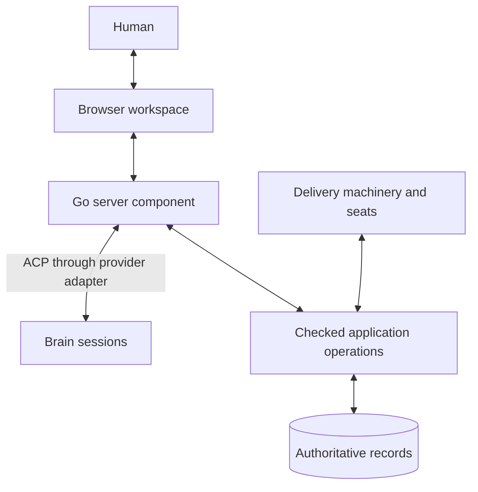

# User Interface Design

Status: Interface structure, core interactions, and the shared-operation approach for conversation and visual controls are confirmed by the human. Supporting implementation decisions remain open. This document does not authorize implementation or execution.

## Purpose

Provide the primary human interface to the MetaSystem through a browser connected to a server component in the Go application.

The interface lets a human discuss the application with an agent, understand work underway, develop intent and designs, examine evidence, and make recorded decisions. The agent connects to the Go application through ACP. Claude, Codex, and Devin are candidate providers; their required capabilities and adapter support need verification before implementation commits to interchangeability.

The interface should become the place where the human naturally thinks about the application and directs its development. Conversation, inspectable records, and explicit decisions belong in the same workspace. It must support the complete set of human activities currently exposed through commands, including uncommon maintenance and recovery, without requiring the human to remember verbs or leave the browser to type them.

Direct manipulation and conversation are equal ways to work. The human can define goals, split them, plan slices, revise an agent's proposal, inspect evidence, and operate the fleet directly. The brain assists with these activities through the same underlying operations; asking it to execute a command is not the only way to use a feature.

## Agreed interface structure

The navigation follows the human's questions about the project. Each section has a distinct responsibility:

| Section | Main contents | Human question |
| --- | --- | --- |
| Brain | The primary conversation workspace, current sitting, shared context, and agent actions; permanently accessible across all sections | Can we discuss or work on what I am seeing? |
| Overview | Changes since the last visit, decisions needing attention, work and fleet summaries | What matters now? |
| Project | Intent, architecture, designs, constraints, success criteria, open questions, and sittings | What are we building, and why? |
| Backlog | Goal definitions, Kanban board, outline, dependencies, splits, slices, and execution detail | What should happen next, how is it divided, and how far has it progressed? |
| Fleet | Registered seats, active sessions, delegates, execution health, and capacity | Who is doing what, and is execution healthy? |
| Decisions | Pending questions, rulings, approvals, delegated authority, and affected subjects | What needs a human choice, and what was decided? |
| Application | Implemented and released behavior, observations, and links to supporting evidence | What does the application actually do? |
| Settings | Providers, connections, identity, execution defaults, and storage; accessed separately in the application shell | How is this workspace configured? |

Four layout decisions organize the detailed design:

1. **The brain has a permanent, primary place.** A fixed Brain entry opens the conversation workspace; the same conversation can stay docked beside every application view. The human and agent share explicit context and can work on the selected subject together. See [The embedded agent workspace](#the-embedded-agent-workspace).
2. **The board shows progress; the outline supports planning.** They present the same backlog. The human can move between them to define goals, split outcomes, plan slices, and follow execution without maintaining separate plans. See [Backlog: definitions and planning](#backlog-definitions-and-planning).
3. **Every goal has one consistent workspace:** Summary, Definition, Plan, Execution, Evidence, and History. The board, Fleet, and Decisions all lead to that same workspace and its original records. See [Backlog item detail](#backlog-item-detail).
4. **Revisions explicitly change future work and preserve history.** Before applying a revised split or slice plan, show what changes, what completed work remains useful, which seats are affected, and which approvals need renewal. Keep earlier plans and their evidence accessible. See [Revise a split or plan after work has started](#revise-a-split-or-plan-after-work-has-started).

The Brain entry sits above the project sections and remains visible when its dock is collapsed. It is the same agent workspace everywhere, with a focused conversation view and a docked view rather than a different chatbot for each section. Human editing and agent actions use the same records and operations. [Complete human operations through the interface](#complete-human-operations-through-the-interface) defines the requirement that routine work, exceptional decisions, maintenance, and recovery all have usable browser flows.

The agreed mixed visual and conversational interaction uses shared application operations and normal result views. An agent action returns its actual result and affected records; the frontend refreshes or opens their existing views. Implement this without a separate agent-to-UI control mechanism. Richer visual guidance is deferred unless a demonstrated need can be served with existing frontend facilities. See [Show action results in the UI](#show-action-results-in-the-ui) and [Implementation of the shared interaction](#implementation-of-the-shared-interaction).

## Basis in the paper

The design develops concepts already described in the paper:

- [The Sitting](../metasystem/docs/paper/15-the-sitting.md): a working conversation that produces recorded facts, decisions, designs, and open questions.
- [The fleet and its brain](../metasystem/docs/paper/19-appendix-functional-design.md#the-fleet-headless-nodes-one-brain-one-channel): a persistent human-facing role that shapes work, observes the fleet, and brings decisions to the responsible authority.
- [Roles from First Principles](../metasystem/docs/paper/07-roles-from-first-principles.md): permissions and independence follow from the hazards each role must control.
- [Memory and Coordination](../metasystem/docs/paper/08-memory-and-coordination.md): durable records support continuity, coordination, and different views of the same underlying state.
- [The Human Role](../metasystem/docs/paper/13-the-human-role.md): human decisions have named authority, scope, reasons, and accountability.

These are the conceptual foundations. The paper also describes capabilities beyond its implementation at the time of writing; this document does not assume that every supporting operation already exists.

## The brain

The conversational agent occupies the brain role: the agent that works with the human to understand the system, shape intent, and guide priorities.

The brain is a persistent responsibility. An individual agent session is a replaceable occupant of that responsibility. Its continuity comes from recorded intent, decisions, designs, open questions, and work state. Changing provider or replacing an exhausted session must not lose the meaning of the work.

The brain can:

- Explain current application behavior using identifiable sources and observations.
- Retrieve relevant intent, designs, rulings, and evidence.
- Help the human expose ambiguity, compare alternatives, and state success conditions.
- Prepare proposed intent, design revisions, backlog items, priorities, and budgets.
- Propose goal decompositions and execution slices, explain their boundaries, and revise them with the human.
- Identify dependencies, incompatible assumptions, duplicated work, and blockers across seats.
- Consolidate questions that require the same human decision.
- Explain consequences and record explicitly authorized decisions through checked application operations.
- Read and work with the underlying objects presented throughout the interface, performing changes within its authority and preparing proposals for reserved actions.
- Return relevant records, evidence, and editable proposals so the frontend can show their normal views; richer presentation control is optional.

Its initial form does not dispatch work. Construction, independent examination, acceptance, and release remain with their designated roles. An agent that helped shape a design cannot independently examine the resulting work.

The same interface may present several roles, but it must preserve their separate contexts and permissions. A fresh label on an existing conversation does not create an independent examiner.

## The embedded agent workspace

### A permanent place beside the work

The desktop layout has a navigation rail, the selected application view, and a resizable Brain dock. The dock is open by default and can be collapsed without losing the conversation or its context. The fixed Brain entry opens it again or expands it into a focused conversation workspace, with referenced artifacts available beside the discussion. On a narrow screen, the same sitting can switch between conversation and its subject without starting a new session.

The dock contains the conversation, a visible list of shared subjects, current agent activity, and proposed or completed actions. Its header identifies the current sitting and provider, with controls to interrupt a response, resume a sitting, or start another topic. Interrupting a response does not silently cancel an already submitted application operation or a fleet job; their status and controls remain explicit.

Navigating between Project, Backlog, Fleet, Decisions, Application, and Settings does not replace the conversation. The human can discuss a goal, open the seat working on it, inspect a failed check, and continue the same discussion. Project → Sittings is a filtered view of this shared conversation history, not a second store.

The workspace also supports starting with conversation before selecting an artifact. “Help me define the architecture” can lead to a live document in Project. “Why is delivery waiting?” can lead to the relevant board selection, seat, or decision. The human can begin from either a question or a visible object.

### Explicit shared context

The application supplies structured view context: project, active section and tab, selected object identities and revisions, active filters, visible result range, observation time, and any selected passage or evidence interval. The dock shows readable context labels such as “Discussing: sign-in goal · Plan · revision 12.” The human can pin a subject, add several related subjects, or let the discussion follow the current selection.

Capture that context with each submitted message so “split this” refers to the selected goal at that moment. Later navigation cannot retarget an operation already being prepared. Pinned subjects remain stable while the human browses elsewhere. A project change is explicit and does not silently apply an earlier instruction in the new project.

Selection and “Discuss with Brain” work for goals, lanes, slices, seats, runs, findings, documents, settings, and charts. The agent can query the underlying records when it needs more than the visible page. It distinguishes the selected or visible set from the full query result; a filtered board or paginated list must not be mistaken for the entire backlog.

Share unsaved edits only as explicitly identified draft context, for example when the human selects text and sends it to the conversation. Keep the saved revision distinguishable from the draft. Sensitive setting values need not be sent to discuss their configuration. The human can inspect and remove attached context.

The browser maintains view context without a model invocation on every navigation or selection event. The Go server provides a bounded context snapshot when the agent is invoked, with further authorized reads available on demand. The agent does not need screenshots or a full dump of every document to understand ordinary application state.

### Working with the underlying objects

Every user-visible object type has an agent-accessible semantic surface for its permitted reads and actions. The agent can retrieve a goal, inspect a design, query fleet state, compare evidence, prepare a split, revise a slice proposal, or explain a setting through the same domain owners used by the UI.

The capability inventory records separately whether the brain may read, propose, or perform each action. Shared access to an object does not imply identical human and agent authority. Within its authority, an explicit conversational request can directly initiate an operation without requiring a second request through a form. Where human approval or another role is required, the agent presents the corresponding proposal or decision control with the exact subject and consequence.

Agent changes carry the agent's identity and their actual authority. A reserved human act is completed by the authenticated human interaction; the agent cannot press its approval control on the human's behalf. Access to the UI does not extend the brain's dispatch, examination, acceptance, or release permissions.

After a domain operation succeeds, the same application state update refreshes the board, detail view, and conversation's action result. Show whether an action is proposed, submitted, completed, refused, or still unresolved. The agent must not report an edit as applied solely because it prepared a patch or sent a request.

### Show action results in the UI

The required interaction is straightforward: the human asks the agent to do something, the application performs the permitted operation, and the UI shows the confirmed result. The traditional controls and the agent tools are two callers of the same application operations.

For example, the human asks, “Change this goal's wording and show me the result.” The agent calls the goal-edit operation. It returns success with the affected goal and revision. The UI updates the existing goal view and shows a result card in the conversation linked to that revision. The human can immediately make another edit in the normal editor and continue the discussion. Reserved decisions still use their required human action.

Use the following flow:

1. Attach the selected subject and revision to the human's message.
2. Let the agent call the same checked application operation that a normal form uses.
3. Return the actual operation status and references to the affected objects or produced artifacts. Reuse the operation's existing result fields where possible.
4. Send that result through the server's ordinary conversation and operation update path. The frontend refreshes the relevant data and renders its existing detail view, editor, comparison, or evidence viewer.
5. Keep a result card and stable “Open result” link in the conversation, including for work completed after the human navigates away.

The frontend owns the mapping from an object or artifact reference to its view. Domain operations and the agent do not need to know browser routes, components, selectors, or page layout. Result cards are rendered from actual tool results, not inferred from the agent's prose. For a proposal, show the existing draft editor and its proposed status; for a saved change, show the confirmed record; for an unresolved operation, show its ongoing status.

“Show me why this failed” follows the same pattern using a read operation: return the relevant finding and artifact references, then show them in the normal Evidence view. “Show the waiting goals” can return a query result for the existing list view. A dedicated tool for each visual component is unnecessary.

After a requested change or proposal completes, show its result in the work area beside the conversation by default when the human is still in the relevant context. A separate “show me” request is unnecessary. Supporting tool reads do not repeatedly change the view; an explicit request to inspect their subject can open it through the same result mechanism. If the human has moved elsewhere or has unsaved edits, preserve their current view and show the result card with its link. This policy belongs to the frontend and uses ordinary navigation and edit protection. It does not require the agent to watch every UI event or acknowledge each rendered frame.

Only the tab participating in the conversation may navigate automatically; other views receive normal data refreshes. A disconnected browser can recover the operation result and its link on reconnection. Display failure never repeats a successful domain mutation. Persist the operation outcome, not a queue of stale navigation commands.

### Limit the additional machinery

The initial implementation needs bounded selection context, application tools, and reusable result presentation. It should reuse the browser's normal data refresh, routing, forms, permissions, and operation tracking. It does not require DOM automation, simulated clicks, screenshot interpretation, an agent-generated UI language, a parallel action engine, or a separate presentation command service.

Richer features such as following a guided tour, custom highlighting, or fine control of filters are optional. Add one only for a demonstrated interaction that normal record links, query results, and existing views cannot serve. If it requires provider-specific hacks or a substantial synchronization layer, defer it and retain “Open result.” Deferring that visual convenience does not remove the agent's underlying domain capability.

Keep dependencies directed from presentation toward application operations. The engine can run without a browser; operations can complete with the conversation closed; a frontend redesign changes its routing and rendering without changing goal semantics or provider adapters. The agent provider needs the verified application-tool integration already required for record interaction, with no separate assumption about browser-control support.

The extra cost of showing results should therefore be assessed separately from the work of exposing the domain operations to the UI and agent. That domain integration is necessary for either interface. This design does not claim that the current code already supplies every required API.

### Example interactions

- From a filtered board: “Why are these waiting?” The agent uses the selected set, retrieves each authoritative blocker, and links its answer to the relevant decision or dependency.
- From a goal: “Split this into three smaller outcomes.” The agent returns an editable split proposal; the frontend displays it in Plan, where the human changes a boundary before publishing the split.
- From Fleet: “Show me what this seat decided before this failure.” The agent retrieves the relevant execution history and artifact references; the frontend shows the existing history and evidence views, with any gaps visible.
- From a design: “Apply this wording change and show me which goals it affects.” The agent performs the permitted edit and returns the saved revision and affected goal references; the frontend displays the document and its impact on linked work.
- From a slice plan: “Keep the completed slices and reorganize the rest.” The agent prepares a revision preserving the completed evidence and exposes the effects on active execution before it is applied.
- From Settings: “Explain this effective limit and propose a change for this project.” The agent returns its source, scope, and proposal, which the frontend presents in the normal settings form; a permitted direct change returns its confirmed result instead.

## Coordination across seats

The brain coordinates purpose, priorities, dependencies, and exceptions. For example, it can identify that two seats depend on an unresolved authentication decision, explain the conflicting assumptions, and bring one bounded question to the human.

The execution machinery owns claiming work, enforcing budgets, observing liveness, and progressing through the required checks. Seats coordinate through authoritative records and continue authorized work when the browser is closed or the brain is unavailable.

The brain should not need to relay every worker action or repeatedly ask workers whether they have finished. Ordinary application machinery observes events and updates state. The agent is invoked when conversation or judgment is useful.

Any future dispatch authority requires an explicit scope and the same enforced boundaries as other callers. It must not emerge implicitly because the brain can describe a next step.

## Component responsibilities

| Component | Responsibility |
| --- | --- |
| Browser workspace | Persistent Brain dock, shared selection context, result cards and normal artifact views, direct editing, and human decisions |
| Go server component | Browser connections, identity, sessions, bounded view context, application tools, ordinary result updates, and checked record operations |
| Agent connected through ACP | Reasoning, explanation, authorized reads and changes, and proposals with references the frontend can display |
| Authoritative records and application operations | Durable state, history, permissions, and valid transitions |
| Delivery machinery and seats | Executing authorized work under their assigned roles |

The server is part of the Go application, with a lifecycle that allows the interface to operate while the delivery engine is stopped. Opening the browser or starting its conversational agent does not start execution.

Browser actions and agent actions use the same underlying operations for changes to authoritative state. The web application must not introduce a second backlog, an independent approval system, or a separate account of work status.

ACP provides the connection to the agent. Application authority remains a responsibility of the Go application. Agent tools, credentials, and workspace access must match the role's permissions; a checked API alone is insufficient if the same agent can bypass it through unrestricted writes.

Provider differences belong behind an adapter. The browser works with application concepts such as a conversation, proposed change, recorded decision, and operation result. It should not depend on provider-specific transcript formats.

The agent's application tools pass through the server's capability and identity checks. Their structured results are available to both the conversation and the frontend's normal views. The required tool integration is an implementation obligation, not an assumption that ACP or every candidate provider already supplies it unchanged. The initial mixed interface uses no separate agent-to-browser control protocol.

## Implementation of the shared interaction

### Reuse the application owners

Implement browser request handlers and agent tool handlers as thin adapters to the same Go application operations. Each operation retains its domain's validation, authority checks, concurrency rules, persistence, and outcome. The adapters translate inputs and outputs; they do not reimplement goal transitions or keep their own state machine.

Reuse the existing Go owners and their result types. Where an operation is currently assembled inside a CLI handler, expose that specific orchestration as a callable application function shared by the CLI and the two new adapters. Do this for the capabilities being added rather than restructuring the entire command system in advance. Do not implement agent requests by generating shell commands or simulate button presses to reach the application.

Keep three small responsibilities distinct:

| Responsibility | Implementation |
| --- | --- |
| Apply or query domain state | Existing Go application operation; shared by CLI, browser, and agent callers |
| Connect a request and result to its caller | Server adapter; identifies the actual actor, request, sitting, and source tab, and delivers the operation result |
| Choose what to display | Existing frontend routing, data loading, and components; resolves record references into ordinary views |

Browser context supplies the subject being discussed, not authority. The server establishes the actual caller from the authenticated human session or scoped agent credentials. The application then checks what that caller may do. A browser-only human act needs a supported human authority path, as described under Settings and setup; it cannot be implemented by labeling the agent's request as human.

### Keep request context and results small

On a chat submission, capture the selected project's identity, subject references and revisions, relevant filters or excerpts, and the sitting's originating tab. Retain this context with the message. A tool call targets explicit domain identifiers; it does not consult whatever happens to be selected later in the browser.

Use the application's current operation result wherever possible. Add only the information needed to connect the result to its request and display the affected objects:

| Information | Meaning |
| --- | --- |
| Request identity | Correlates the input, tool execution, conversation entry, and retry of that same request |
| Operation identity, when applicable | Links to the existing durable record for a longer or separately tracked operation |
| Outcome | Actual completed, running, refused, conflict, or unresolved outcome from the operation owner |
| Result references | Project-scoped object or artifact kind, stable identifier, and revision when relevant |
| Changed references | Records or collections the frontend must refresh after a mutation, including affected dependencies |
| Problem details, when applicable | The unmet condition, current revision for a conflict, and the application's supported recovery options |

These are required meanings, not a reason to replace all existing response formats with a new universal command framework. A read can return its bounded query data directly. A newly saved proposal returns a proposal reference and remains visibly a proposal; successful draft creation is not approval of the proposed work.

Result references contain domain identity rather than browser routes or component names. The frontend resolves them through its existing navigation helpers. Where an operation affects several objects, show its results together with links to each; do not invent an ordering by asking the model to choose a page.

### Deliver the same result to the agent and the browser

The server receives the structured result directly from the operation owner. It returns that result to the agent's tool call and associates it with the relevant conversation entry. The frontend renders the result card from this server-provided data even if the agent's explanatory response has not finished or its session subsequently ends.

Use ordinary HTTP requests for browser reads and mutations. Reuse the server-to-browser stream carrying conversation output for operation notifications; server-sent events are sufficient if no other transport has already been selected. A mutation result or notification triggers a reload through the normal read operation. Notification delivery is a convenience for freshness, while the read and operation records establish the actual state. The diagnostic flight recorder is not the source of authoritative status.

When the event stream reconnects, read the relevant current records and any tracked pending operation outcomes. Use existing operation identities and duplicate-request protection; a lost response is not grounds to submit a fresh mutation. Extend the owning operation only where it lacks the required retry behavior. The conversation stores references and enough result metadata to recover its action cards, without becoming a second goal ledger.

For long operations, return the existing operation or run reference and show its status through the same tracking used by traditional controls. Conversation streaming and engine execution remain independent. No new background job system is needed merely to show an agent's result.

### Render results with the existing interface

The frontend applies a simple policy for the originating tab:

1. Refresh affected saved records and lists after a confirmed mutation. Preserve unsaved editor buffers and show a conflict if their saved basis changed.
2. Add or update the result card with its actual status and “Open result” link.
3. For the requested change or proposal, or an explicit inspection request, reveal the result through the ordinary route, detail pane, or editor when the human remains in the source context and has no conflicting unsaved work. Supporting reads supply references without navigating the work area.
4. Otherwise, keep the current view and let the human open the result from the card. Other tabs can refresh their data but never inherit this navigation.

Opening a historical result resolves the referenced revision where available. Show when a newer revision exists rather than silently substituting it for the result under discussion. If a reference is unavailable or its kind has no dedicated renderer yet, retain the outcome and show the ordinary record or artifact detail with the limitation stated; do not generate a new UI from agent prose.

After the human edits the displayed result manually, the normal operation updates the same record. The next chat message supplies its current selection and revision, and subsequent mutations check their expected revisions. No separate synchronization between a chat-owned copy and a UI-owned copy is required, and navigation or rendering does not itself invoke the model.

### Build one complete interaction first

Start with one existing goal read and permitted goal edit:

1. Expose their Go owner through a browser handler and one provider's application-tool adapter, preserving actor identity and existing authority.
2. Build the normal goal editor, selection context, and a reusable result card using their actual responses.
3. Drive “edit this goal and show me the result” through the agent, then make a manual edit in that same editor and discuss the updated record.
4. Check a stale edit, a lost response, an agent session ending after success, a disconnected browser, and a completed result arriving after the human navigates elsewhere. Confirm that none duplicates a mutation, loses the recorded outcome, or overwrites unsaved work.
5. Apply the same pattern to draft designs, split proposals, slice plans, queries, decisions, and evidence. Add domain capabilities where needed; reuse the interaction pattern instead of adding a UI-control tool for each screen.

This implementation sequence validates the connection before expanding capability coverage. A capability's domain work may be substantial, but showing its result should reuse these same few pieces. A change to page layout or provider must not require changes to goal semantics. If a proposed visual convenience requires a separate control protocol, replayable UI commands, or provider-specific browser automation, leave it out and use the normal result view and link.

## Conversation and session lifecycle

Organize conversations around topics and artifacts. A design discussion, a question about application behavior, and an investigation of a failure can each be resumed with their relevant records.

One coherent entry point can contain several bounded conversations. The system need not carry the application's entire history in one agent context. Each session receives the context its purpose requires, including the versions being discussed.

Continuity requires:

- Durable conversation history with appropriate access limits.
- Working records of facts, proposals, decisions, and open questions as the conversation progresses.
- Links from those records to the artifacts and evidence they concern.
- A clear distinction between completed operations, proposed operations, and operations whose result is still unknown.
- Enough recorded context for a fresh agent and the human to continue after interruption.

The durable history does not imply that every later actor receives it. In particular, independent examiners must receive the permitted examination context without the design sitting's exploratory reasoning.

Closing a browser does not cancel authorized work. Reconnecting restores the recorded conversation and current state. Agent availability, server connectivity, and engine state are displayed separately so that one does not imply another.

## From conversation to authoritative records

A sitting maintains four visible kinds of working material:

| Material | What it captures |
| --- | --- |
| Facts | Claims about the application, linked to a source, version, or observation |
| Proposals | Possible intent, designs, priorities, budgets, or changes |
| Decisions | Explicit human choices, their reasons, scope, and authority |
| Open questions | Matters deliberately left unresolved or needing further evidence |

Working material is saved during the discussion. Saving a tentative statement does not make it an authoritative decision.

When a proposal is ready, the interface presents the exact change in a form the human can inspect and edit. For example:

> **Proposed decision:** Existing sessions adopt the new inactivity limit.
>
> **Reason:** Leaving older sessions exempt would undermine the security outcome.
>
> **Open question:** How should an upload already in progress behave?

An explicit human action records the decision. The record identifies who decided, their authority and scope, the reason they gave, and the version affected. Conversational assent to an explanation must not silently approve unrelated work.

Recording intent and authorizing execution are distinct actions. A human can complete a design and leave it available for later work without starting the engine or committing an execution budget.

For an execution approval, the interface presents the exact work and budget being authorized. The server establishes the human's identity and authority independently of the agent's claims. The agent cannot impersonate a human approval through its own tools.

Before a consequential revision is committed, the interface shows its known effects: goals needing revision, approvals that become stale, and active work requiring a safe stop or reconsideration. If the underlying record changes while the human is considering a proposal, the system exposes that change and revalidates the operation against the current version.

Ordinary draft editing should remain fluid. Explicit decisions belong at meaningful authority boundaries rather than after every sentence.

## The browser workspace

Conversation and its subject are visible together. An artifact occupies the main workspace, with the conversation beside it. Selecting a paragraph, backlog item, finding, or observation supplies precise context for a question.

The agent can propose an edit beside the current text. The human can inspect the differences, edit the proposal directly, and record the result. Reviewing a proposal must not require reconstructing it from a long transcript.

The primary destinations and their responsibilities are defined in [Agreed interface structure](#agreed-interface-structure). Storage directories, agent process names, and internal record formats do not determine menu labels.

Project selection, search, connection state, the permanent Brain entry, and settings belong in the surrounding application shell. Settings has named pages for runtimes and models, connections and channels, identity and authority, execution defaults, and storage and retention. The Brain dock and focused conversation workspace follow [The embedded agent workspace](#the-embedded-agent-workspace). Conversation history belongs to the project and its subjects; opening a new sitting does not add another navigation section.

Opening a subject supplies its context without requiring the human to copy records into chat. Evidence is first accessible beside the subject it explains: a backlog item, a seat's run, a decision, or an application behavior. A shared evidence browser and search can serve all of these entry points without creating competing copies.

Backlog and Fleet present two views of the same execution. Backlog starts with an outcome and finds its workers; Fleet starts with a worker and finds its outcomes. Navigation preserves the selected project, goal, run, and artifact version when moving between them. Every detail view has a stable link that can be shared or reopened.

### Rules for an intuitive structure

Give every object one detail page and every action one primary home. Other views link to that same page or action with the subject already selected. For example, answering a question from a goal, a seat, or the Decisions inbox opens the same decision; it does not create three answers.

Keep the main navigation stable throughout the project. At the beginning, Project is the natural starting point for intent and architecture. During delivery, Backlog and Fleet become more prominent in Overview. Empty sections explain what belongs there and offer an appropriate first action; the application does not grow a different menu as work progresses.

Use three levels of interaction:

1. Everyday actions appear beside the object: edit a goal, divide work, move a card, answer a question, inspect a result.
2. Additional actions appear in a labeled object menu: change a budget, release an assignment, reopen work, inspect retained artifacts.
3. Operational recovery appears in a contextual diagnostics panel with the observed problem, proposed repair, affected objects, and resulting state. Shared installation configuration remains in Settings.

Do not make an “Advanced” page the sole home of unrelated capabilities. A recovery action belongs with the goal, seat, connection, or evidence store it repairs. Global search and an action finder provide a second route using ordinary phrases such as “split this goal,” “increase its budget,” or “recover a stopped seat.” They open the same structured forms and checks as the contextual actions.

Keep the selected subject visible in the conversation and action forms. Use readable names, breadcrumbs, and clear descriptions of scope. Preserve filters and board position when closing a detail panel. Board, outline, and dependency views share selection and filters; changing view does not change data.

Show relevant unavailable actions with a concrete reason and a path to satisfy the missing condition. Hide internal machinery that is never a human action. Common actions should be usable without a conversation or technical knowledge, while the original records remain reachable for detailed investigation.

### Overview

Lead with “What needs me?” and “What changed since I last looked?”

Useful entries include a decision blocking several goals, a changed assumption, an examination finding, a newly observed production problem, or completed work with its evidence. Each entry links to the underlying records.

Seat activity, tool calls, and logs remain available for investigation. The overview should support a useful visit of a few minutes without requiring the human to read a stream of internal activity.

### Project: intent and architecture before execution

The project needs a durable place for groundwork before a goal exists. The human and brain can develop a vision, explore users and their needs, identify constraints, define architecture, and leave questions open without supplying an execution budget or manufacturing a task for every note.

Use these subsections:

- **Intent:** purpose, intended users, desired outcomes, boundaries, and success criteria.
- **Architecture:** system context, components, responsibilities, interfaces, data flows, dependencies, and architectural decisions.
- **Designs:** feature and change designs, alternatives, current proposals, and the versions governing active work.
- **Constraints and assurance:** requirements, the covenant where present, relevant project rules, checks, budgets, and guardrails, described in language useful to the human.
- **Open questions:** unresolved assumptions and choices, linked to the designs or outcomes they affect.
- **Sittings:** resumable conversations with their working records and resulting artifacts.

These are views over owned documents and records. A project may keep its architecture in existing documentation; the interface should show that material in Architecture and retain its canonical location. It should not require a duplicate document to populate a screen.

Drafts carry a subject, working status, source links, and revision history. Recorded decisions identify their authority. An exploratory architectural option must remain distinguishable from the current accepted architecture. The application should expose missing foundations as “Not yet recorded” and allow the human to work on them with the brain, without filling them with invented agreement.

A project artifact can inform several goals, and a goal can depend on several artifacts. “Create backlog item from this” proposes a bounded outcome linked to the source material and its version; it does not convert the whole document into a task or erase the earlier discussion. Later revisions show which linked work may need reconsideration. Early design work remains visible even if the human never chooses to execute it.

### Backlog: definitions and planning

Backlog is the workspace for maintaining goal definitions as well as observing progress. Its views share the same goals:

| View | Primary use |
| --- | --- |
| Board | Read readiness and progress; move or prioritize work |
| Outline | Define outcomes, inspect decompositions, and expand a goal's planned slices |
| Dependencies | Understand ordering, blockers, and the effects of changing a relationship |
| List | Search, compare fields, and apply supported changes to selected items |

The board is the default for day-to-day execution; the outline is the natural planning surface when dividing a large outcome. There is no separate backlog maintained by the brain. Human edits and agent proposals address the same versioned definitions.

The goal editor covers the outcome, constraints, success conditions, linked intent and design, next step, dependencies, priority, grouping, execution limits, and any machine restriction. It supports creating work directly or from Project material, refining a draft, dividing work, changing relationships, and revising earlier decisions. It shows which values are human choices, derived values, or observations from execution. Derived classification is changed through its supported assessment or exception flow, not by overwriting a display field.

An agent's proposed change appears as an editable before-and-after comparison with its stated reason. The human can accept, adjust, reject with a reason, or ask for a different proposal. Direct human edits require no agent invocation. Draft saving, publishing a definition, and authorizing execution remain distinguishable actions.

#### Kanban board

The proposed lane layout is:

| Lane | Meaning and source |
| --- | --- |
| Draft | A persisted goal proposal that has not passed intake |
| To Do | A queued goal that has not been authorized for execution |
| Ready for Work | An approved goal currently eligible to be claimed |
| In Progress | Claimed work whose recorded phase is execution |
| Review and Verification | Claimed work undergoing examination, verification, or waiting to land, with the actual phase visible |
| Waiting | Work explicitly parked or blocked, with the reason and the phase from which it is waiting |
| Done | A recorded completed goal, with its actual outcome and completion evidence |

These lanes are a presentation of existing records. Review and Verification is a projection of execution phase, not a new goal state. Waiting takes precedence over the normal active or ready lane when an authoritative blocker applies; a queued item can retain its To Do placement with its intake or approval gaps visible. Dropped and abandoned work remains accessible through a closed-items filter with the recorded reason. The projection must place each item once and expose its underlying state in detail.

Completion of implementation, completion of review, landing, and release are separate facts. An implementer returning successfully does not by itself move the goal to Done. The interface uses the authoritative completion operation and describes what “done” establishes for this project. It never infers release from a completed goal. A parent retired by decomposition is shown as “Split into goals,” accessible as a grouping and historical record, rather than presented as a delivered outcome merely because its underlying state is done.

Each card shows the outcome in plain language, priority, current seat when assigned, current phase, and any blocker or pending human question. A compact indicator shows design availability and whether implementation is unstarted, underway, or finished. Evidence availability is separate from completion state. Filters include outcome or initiative, labels, priority, seat, and items requiring the human.

#### Drag and drop

Dragging an item requests the corresponding application operation. It never directly changes a browser-only status field.

- **Draft to To Do:** perform intake and create the goal, preserving the source draft's provenance. Show missing intake information before committing the operation.
- **To Do to Ready for Work:** present the exact intent, revision, and execution budget for human authorization. Missing budget or authority information is supplied through the same interaction. If the engine is running, explain that an eligible seat may claim the approved item immediately; if stopped, the item waits without starting it.
- **Ready for Work to To Do:** request withdrawal of approval. If a seat has already claimed the item, surface the new state and use the applicable withdrawal or safe-stop operation rather than pretending the work never began.
- **Reordering:** change the recorded priority or order where supported, showing dependency constraints and the consequences of reprioritizing active work.
- **Execution and completion lanes:** reflect actual execution. A move can request an available operation, such as parking work, but cannot manufacture a claim, successful review, or completion. Unsupported moves explain the missing condition.

Use the same move actions through a keyboard-accessible menu. Display a pending move until the server confirms the operation. On rejection or concurrent change, restore the actual placement and explain why. Retries must not duplicate an approval or create a second goal.

#### Backlog item detail

Opening a card first shows the current outcome, status, active phase, owner, latest durable result, blockers, and next expected transition. Use a consistent set of detail tabs:

| Detail | Contents |
| --- | --- |
| Summary | Outcome, current state, ownership, blockers, latest result, and the next expected transition |
| Definition | Editable outcome, constraints, success criteria, design references, priority, budget, authority, and related decisions |
| Plan | Smaller goals, slices, ordering, dependencies, proposal comparisons, and revision of the remaining work |
| Execution | Seat, delegates, roles, attempts, rounds, time, budgets, and recorded progress |
| Evidence | Briefs, exact input and design revisions, returns, patches, checks, findings, dispositions, decisions, landings, and retained artifacts |
| History | State transitions, revisions, handoffs, failures, retries, and the relationships between them |

The detail remains useful while work is underway. A completed item opens onto its result and evidence; it does not disappear from the accessible history when live records or worktrees are cleaned up.

#### Divide a goal into smaller goals

“Split into goals” opens a planning editor in the goal's Plan tab. Explain its purpose in ordinary language: create smaller outcomes that can be prioritized, authorized, and completed separately. The human can start with an empty proposal or ask the brain to suggest a split.

Keep the original outcome and constraints visible alongside the proposed members. Each member has its own outcome, completion conditions, design references, and dependencies. The editor supports adding, editing, removing, and reordering proposed members, with a compact dependency view. The brain can explain the proposed boundaries and identify uncovered requirements, overlap, or dependencies that prevent independent delivery.

Before publishing, show:

- Which part of the original outcome each member covers and any explicitly deferred or dropped scope.
- Which members depend on each other or on other goals, with invalid or cyclic relationships identified.
- How existing dependents will be redirected and which affected items need reconsideration.
- The parent's resulting status, the members' initial states, and any approvals or budgets that do not carry over.
- The exact proposal and source revision being accepted, the author of the proposal, and the authority recording the split.

Publish through the existing split operation as one checked change. The inspected implementation concludes the parent as decomposed, creates queued members, records the relationship, and redirects dependencies. It does not automatically approve the new members. Preserve the parent and the accepted proposal as accessible history, while the new members appear on the board and under their original outcome in the outline.

Member order in the editor does not become execution order implicitly. Publish scheduling preferences through the supported priority and dependency operations and report their outcome. Rich definition fields that the current split format does not carry must remain linked to their owned artifacts or require an explicit extension to that owner.

The human can edit an agent's proposal before publication and revise member definitions afterward through the same editor and checked operations. A proposal's authorship never prevents the human from challenging it. Editing definitions with existing approvals must expose the resulting approval changes.

#### Plan a goal's execution slices

“Plan slices” is the second choice under “Divide work.” Explain the distinction at the point of use: slices are bounded implementation units serving one goal; separate goals are independently governed outcomes. A slice is not just a child goal with a different label.

The human can prepare slices before execution, and the brain can propose or revise them later. A planned slice contains its intended result, scope, linked section of the design, dependencies, expected verification, and proposed execution limits where relevant. It may name an appropriate role or required capability without prematurely assigning a live process.

Support adding, splitting, combining, and reordering unstarted slices. Dragging to reorder changes order; changing a dependency or moving scope to another slice is a separately visible edit. Neither gesture silently changes the goal's outcome, total authorized budget, or completed work.

Show planned slices alongside their execution state when dispatched: unstarted, underway, waiting, completed, or superseded, as supported by their owning records. A slice can have several delegate attempts and review rounds. Preserve the distinction between the plan, an attempt to carry it out, and evidence that it succeeded.

At dispatch, bind the job to the selected goal revision, design revision, and slice-plan revision. If the agent needs to change the approved plan, it records the proposed change and applies it only within its actual authority. The human can inspect what changed and why. Explicit human constraints remain binding until revised by the appropriate authority; suggestions and delegated implementation freedoms remain visibly distinguishable.

The repository has slice admission and a first-slicing marker, but this inspection has not established a complete editable slice-plan owner. Providing that durable plan and its links to dispatched attempts is a required backend capability if no existing owner covers it. A browser-only checklist or reconstruction from job names cannot satisfy the feature.

#### Revise a split or plan after work has started

“Revise remaining work” uses the same planning editor with completed and active work visible. The human can revise an agent's earlier decisions without pretending that the old plan or its consequences never existed.

| Situation | Editing behavior |
| --- | --- |
| Unpublished proposal | Freely edit, split, combine, reorder, or discard the proposal; no execution state changes |
| Published but unstarted work | Revise through supported operations; show changes to dependencies, approvals, scope, and budgets |
| Active execution | Prepare a revised plan, identify affected claims and attempts, and apply changes through the required safe-stop, release, or successor flow |
| Completed work | Retain the original definition and evidence; create explicit corrective or successor work for changed intent |

There is no destructive “unsplit” that erases published lineage. Before publishing, ordinary undo applies to draft edits. After publishing, reversal is a recorded compensating action when supported. The existing goal split refuses once slicing has started and retires the original parent; the interface must guide the human through valid revisions or successor goals rather than promise an unsupported reversal.

Show an impact preview before applying a revision: work retained, work changed, discarded candidate work if any, affected goals and seats, additional budget, stale evidence, and renewed decisions required. Do not label published work as changed until the operation has actually succeeded. Partial or interrupted multi-step revisions remain visible with their recovery state.

The outline keeps the original outcome, current members, and superseded plans navigable. Roll-up status names unresolved members and missing evidence; completing all coding slices does not alone prove the overall goal complete.

### Execution evidence: from outcome to original artifacts

The human must be able to follow what led to the current state or outcome. Provide three levels of detail: a concise status or outcome explanation, a linked timeline of actions and decisions, and the original captured artifacts.

The timeline groups related events by attempt, delegate, review round, and candidate. It exposes failures, rejected approaches, repairs, stop reasons, and superseded results alongside successful ones. Every decision has its author, stated rationale when recorded, subject, and supporting references. An inferred explanation is labeled as such and cannot replace a missing recorded reason.

Use a navigable chain such as:

`Project intent → design revision → goal revision → seat/run → delegate attempt → candidate → examination and proof → disposition → landing → release observation, where available`

This is a graph of recorded relationships, not necessarily one linear sequence. Parallel delegates, repeated reviews, and a proof covering several goals must remain representable without duplicating or misattributing evidence. An expandable chronological view can coexist with these links; timestamps from different machines do not alone establish causality.

Show the full captured record available to the authorized human: inputs and briefs, tool activity and outputs retained by the runtime, explicit decisions and rationales, reports, candidate changes, checks, findings, and operation results. This does not promise access to a model's unrecorded internal reasoning. A human's inspection view also does not widen the context given to an independent examiner.

Artifact links identify their source, goal or run, relevant version or candidate, capture time, and integrity metadata where available. Resolve historical evidence through its durable location after temporary artifacts are cleaned up. Evidence retention and retrieval are part of this feature, not something a timeline alone supplies.

Display capture gaps explicitly: “Not recorded,” “Not yet captured,” “Unavailable on this node,” “Removed under retention policy,” or “Integrity check failed,” as supported by the records. A status record can still establish current state when diagnostic logs are incomplete. An empty evidence view must not be described as proof that nothing happened or as a complete execution history.

Where requirements name expected evidence, show what was expected, captured, and remains retrievable. This is an account of evidence coverage, not a percentage that claims to measure the correctness of the result.

### Fleet: seats and execution

Fleet is a separate top-level view with a complete registered-seat inventory and a filtered view of active execution. A seat's durable registration, its current session, and its delegate jobs are different things. A machine can host several seats, and a registered seat may currently have no live session.

The initial Fleet screen shows registered and active counts with observation times, grouped by machine when useful. Each seat row includes:

- Seat identity, machine or checkout, and current role.
- Registration status and current session identity, provider, and model when recorded.
- Observed execution state: idle, working, waiting, stopped, offline, or unknown.
- Current goal or goals, execution phase, next recorded step, and outstanding question.
- Active delegates and their roles, progress, latest durable output, and stop reasons.
- Measured budget consumption and configured limits, keeping estimates distinguishable from measurements.
- Last observation, connectivity, supervision health, and available capacity where those facts are known.

Selecting a seat opens its current execution and recent history. Selecting a delegate opens its brief, context references, candidate, tool activity, return, and evidence. Selecting the goal moves directly to the same Backlog detail. The human can work from either the question “What happened to this goal?” or “What is this seat doing?”

Use authoritative session, process, claim, and supervision records to establish state. A recent log line is not proof of healthy progress; silence is not proof of death. An unreachable node is shown as unknown or disconnected with its last observation, never quietly counted as idle or available.

The human should be able to identify stalled progress, unanswered questions, capacity limits, repeated failures, and work that no longer has a live owner. The view distinguishes an observed condition from the brain's diagnosis of it. Fleet controls use checked operations with clear scope: stopping an agent conversation, parking a goal, and stopping an engine are different actions.

A durable inventory of registered seats and an aggregation path for remote observations must be verified before claiming fleet-wide coverage. Existing local session announcements alone cannot enumerate every registered but inactive seat. Missing sources appear as explicit coverage gaps.

### Decisions

Present a bounded question, relevant evidence, genuine alternatives, and the consequence of delay. A recommendation may be included, but competing evidence and unresolved uncertainty remain visible.

The human can inspect original findings and supporting observations. The brain's retelling must not become the only accessible account of an independent examination.

The inbox includes questions about scope, splits, budgets, exceptions, risks, and execution recovery. Every question links to the affected object, and answering it from that object's page resolves the same inbox entry. Recorded decisions can be searched by subject, author, and effect. Delegations of authority have a dedicated view showing scope, expiry, and withdrawal; granting a delegation is distinct from approving a particular goal.

From a recorded decision or refusal, the human can inspect its basis and raise a challenge linked to the original subject. Any resulting revision follows the applicable authority path and preserves the earlier decision and its reasons.

### Application

Connect descriptions of behavior to the application version and evidence supporting them. Keep designed, implemented, examined, accepted, released, and observed behavior distinguishable.

Where live observations are unavailable, show that limitation explicitly. Recorded intent alone does not establish what production currently does.

### Settings and setup

Settings holds choices that configure the workspace or its infrastructure rather than one piece of work. Its named pages cover runtime installation and capability checks, model and role preferences, channels and connections, human identity and enrollment, execution defaults, and evidence storage and retention. A value shows its effective setting and source so a local override cannot look like a project-wide change.

Project-specific requirements and assurance belong under Project. A goal's budget belongs in its Definition. A live seat's engine controls belong in Fleet. Those views can link to the applicable setting without moving all configuration into one undifferentiated form.

Setup and recovery must support browser-native proof of human authority. Where the current implementation requires an enrolled interactive terminal, extending the authority owner to accept an equally explicit authenticated browser act is a backend requirement. Passing the agent's credentials through a form or asking the human to run a terminal verb does not satisfy this design.

## Complete human operations through the interface

Treat the command surface as an inventory of capabilities to place, not as the menu structure. The goal is that every supported human activity has an understandable browser workflow. No operation counts as covered solely because chat can suggest its command or a terminal panel can execute it.

The following map comes from static inspection of `cmd/metasystem/main.go` and the goal, split, slice, and process handlers. Command names here are implementation references for the design; normal product labels describe the intended action.

| Human activity | Primary home and interface action | Existing operation families to connect |
| --- | --- | --- |
| Establish or revise purpose, constraints, and architecture | Project editors and contextual sitting | Existing document owners, covenant and project configuration operations |
| Create, edit, order, group, or restrict where goals run | Backlog Definition, board ordering, outline, and dependencies | `goal open/edit/set-next/set-priority/set-arc/detach/set-pin`; classification and obligation operations |
| Split goals and maintain their execution plan | Backlog Plan: Split into goals, Plan slices, Revise remaining work | `goal split`, recorded decomposition and membership, slice admission; editable slice-plan ownership still to establish |
| Approve work, withdraw it, or revise its budget | Backlog readiness actions and Definition; linked Decisions item | `goal approve/unapprove/set-budget/extend-budget`, within the caller's authority |
| Pause, resume, release, transfer, abandon, or reopen work | Backlog item actions, linked from Fleet | `goal park/unpark/resume/release/steal/handover/abandon/reopen`; relevant claim operations |
| Record exceptional permission, risk acceptance, or recurring obligations | The affected goal or finding and its Decisions record | `goal accept-risk/carry/set-obligation/discharge-review-obligation/read-items` and the applicable authority checks |
| Delegate authority or withdraw a delegation | Decisions → Delegations | `goal grant/revoke` and the current authority owner's scope and expiry rules |
| Designate the brain and manage conversation continuity | Fleet seat role and conversation session controls | `brain declare/show/withdraw`, applicable boot, session, and context handoff operations |
| Start, stop, resume, or inspect execution infrastructure | Fleet machine or seat controls, with scope explicit | Top-level `up/stop/status/arm/health`, session stop, supervision and steward operations |
| Launch, follow up, cancel, inspect, or acknowledge an authorized run | Goal Execution or Fleet run detail | Public `delegate`, `launch`, `unit`, and `run` workflows, including supported claim and ownership operations |
| Define and run a bounded mission | Goal Execution → execution agreement and run details | Public mission contract validation/sealing and `mission start/resume/status/answer/resolve-taint` |
| Ask, answer, or withdraw a human question; inspect channel delivery | Decisions and its connected-channel delivery detail | `channel ask/show/close/status`, mission answers, and existing durable answer handling |
| Inspect or run checks and examine findings | Project → Constraints and assurance; goal Evidence → Checks and reviews | Public `test`, covenant evidence, conformance, validation, and proof-run workflows |
| Inspect candidate acceptance and landing, or resolve a held landing | Goal Execution and Evidence; linked decision when required | Public landing and goal-branch operations, held work, carry decisions, and completion operations |
| Measure execution, cost, context use, and progress | Fleet summaries and run detail; Overview summaries | `metrics report`, public context reporting, run and launch reports, and authoritative status projections |
| Diagnose stopped work, acknowledge alerts, recover ownership, or repair synchronization | Diagnostics on the affected goal, seat, or connection | Goal recovery/repair/reconcile/fetch, process acknowledgments, health alerts, lease and supervision recovery |
| Configure runtimes, models, roles, channels, identity, and engine compatibility | Named Settings pages with validation and change preview | `runtime setup/list/self-check`, configuration and launch settings, enrollment, and engine compatibility operations |
| Inspect, preserve, export, or retire execution evidence and concluded history | Evidence detail; Settings → Storage and retention for policy | Existing mirror and collection operations, evidence cleanup, and supported goal/run/context pruning |
| Initialize, migrate, or repair a project's records | Project setup or contextual recovery, with the reviewed changes visible | Goal migration, declaration of no active intent, reconciliation, recovery, and applicable adoption operations |

An operation that requires an independent worker or custodian remains under that role. For example, the human can request examination and inspect its results; the UI cannot manufacture a clean examination by setting a flag. Existing human authority to authorize acceptance, exceptions, or recovery remains available through its actual checked operation.

The map covers capability groups, not a certification that all browser handlers exist. Before implementation is considered complete, maintain an operation coverage inventory against the actual routed command surface and its subcommands. Each entry must identify its intended caller, public capability, UI location, required fields, authority, preconditions, result, recovery path, and an acceptance scenario. Record the brain's read, propose, and perform permissions separately, and identify the existing view or editor that presents each result. Classify entries as a direct human action, machinery within a human workflow, or genuinely internal/test-only. A human-facing capability cannot be dropped merely because its current entry point looks technical.

Low-level record mutation, process bookkeeping, adapters, test fixtures, and internal workers execute through their owning workflows. They are not unrestricted forms for bypassing those workflows. Where a capability has no suitable domain operation yet, record the missing backend work explicitly rather than using arbitrary shell execution or direct file mutation as a substitute.

### Consistent action behavior

All action surfaces share a small interaction pattern: select the subject, state the intended change, inspect its consequence where material, perform the checked operation, and show the durable result. Common actions keep the form short; more consequential actions reveal the additional information they actually require.

The application supplies current allowed actions and refusal reasons from the owning domain. The browser can help validate inputs, but it does not maintain an independent authority or transition policy. The server repeats the checks against current state at submission and records the actual human or agent actor.

Long operations return an operation identity and display progress, outcome, and evidence. A disconnected tab can reattach to that operation. Bulk actions show scope and per-item results and never imply atomicity that the backend does not provide. Sensitive changes bind to the reviewed versions; stale proposals are returned for reconsideration.

Translate a refusal into the affected subject, the unmet condition, and available next actions. If a current command error recommends another verb, provide the corresponding contextual recovery action. Requiring the human to copy that command into a terminal is an uncovered workflow, not a finished user experience.

The action finder supports names and synonyms for these activities but is secondary to the ordinary navigation. It must remain possible to discover an action without already knowing that it exists or what the engine calls it.

## Existing information homes and integration gaps

A static inspection of the repository found the following owners. Paths below are relative to the managed MetaSystem root unless stated otherwise; in this checkout that root is `metasystem/`. The discussion design itself remains in the host repository's `plans/user-interface-design.md` as requested. No live engine inspection is implied by this inventory.

| Information | Existing home or implementation | Where it appears in the interface |
| --- | --- | --- |
| Draft work | `plans/goals-drafts/`, described by `docs/backlog-mechanism.md`; proposal registers also exist in `memory/` | Project proposals and the Backlog Draft lane, retaining one canonical record per proposal |
| Current backlog | `plans/goals/backlog.md` and per-goal `plans/goals/<id>.md`, represented by `internal/goal/root.go` and `file.go` | Backlog board, item detail, and dependencies |
| Goal decompositions and slicing boundaries | `internal/goal/split.go` records members, the retired parent, ratification, and dependency changes; `internal/goal/sliced.go` records the start of slicing; `internal/dispatch/slice.go` checks slice admission | Backlog Plan and historical decomposition, with an explicit gap for any missing editable slice-plan owner |
| Active designs and working notes | `plans/`; current architecture and static explanation in `docs/`, with existing project-owned documents retained at their locations | Project Architecture and Designs, linked from affected goals |
| Concluded history | `records/`, including the goal history owned by the goal engine under `records/goals/` | Completed item details, past designs, decisions, and execution history |
| Living rulings and registers | `memory/rulings.md`, `memory/known-issues.md`, and other living registers | Decisions, relevant Project sections, and linked backlog or application concerns |
| Requirements tied to checks | The adopted application's root `covenant.json`, supported by `internal/covenant` | Project Intent and Constraints and assurance, linked to evidence |
| Delegate execution | `artifacts/agents/jobs/<job-id>.json`, transcript sidecars, and chain or round artifacts under `artifacts/agents/` | Backlog Execution and Evidence; Fleet seat and delegate detail |
| Retained evidence | The project's configured durable evidence root and mirrored artifacts, described in `plans/README.md` | Original-artifact drill-down after temporary execution files are gone |
| Local sessions and supervision | Announcements under `artifacts/agents/mains/`, census and lease implementations, and supervision state | Fleet observations, ownership, and session detail |
| Diagnostic event history | `artifacts/agents/events.jsonl`, governed by `docs/design/flight-recorder.md` | Execution timelines and diagnostics, linked back to authoritative records |

The code already models queued, approved, claimed, parked, done, and abandoned goals, with approval, claim, landing, history, and revision information. Some prose still describes an older single-file goal ledger. The integration must use the current application owner and supported format rather than infer state from a convenient older document.

The flight recorder explicitly treats events as diagnostic witnesses; authoritative records establish verdicts and state. The interface follows that distinction when combining a timeline with current status.

Several foundations exist, but their presence does not establish a complete browser-ready API or joined fleet history. The remaining integration questions include durable seat registration across machines, access to remote observations and retained artifacts, reliable links among goal revisions and delegate attempts, and completeness of captured decision rationale.

The split implementation is particularly relevant to the interface: it preserves decomposition history, creates unapproved queued members, and refuses a new goal split once slicing has begun. A complete human planning experience therefore needs both a proposal editor and supported revision/successor workflows. It cannot be implemented as free editing of the rendered hierarchy.

Project-specific vision and doctrine are recognized in the adoption documentation, while a dedicated structured store for sittings, their open questions, and their connection to these artifacts has not been established by this inspection. Before adding storage, identify each project's existing owner. Reuse it where present; where absent, add a minimal versioned artifact in the appropriate existing category: active material in `plans/`, standing explanation in project documentation, living registers in `memory/`, and concluded history in `records/`. This is a proposal for integration, not a claim that every corresponding writer or schema already exists.

The UI may maintain a rebuildable index of artifact types, identifiers, links, and source versions to support navigation and search. The index must not become a second source of intent, authority, or execution state. Moving from an exploratory note to a design to executable work changes its recorded status and relationships explicitly; appearing under a menu never grants it authority.

## Trustworthy state and interaction

The browser renders structured facts such as work state, timestamps, budgets, and recorded evidence directly from the application. Reading basic status does not require an agent invocation.

The agent explains those facts: why work stopped, what a dependency means, or which choices could resolve a question. Material claims link back to their sources. Unknown or stale information remains identifiable.

The server owns event delivery, reconnection, and operation results. Retrying after a disconnected browser must not duplicate a decision or execution request. A timeout must not be presented as evidence that an operation failed or never happened.

The interface remains useful while the agent is unavailable: records and pending decisions can still be inspected through the permissions of the human using it. With the engine stopped, the human can discuss intent and prepare designs. Engine controls are explicit and separate from launching a sitting.

## Further capabilities

These extend the required editing, impact previews, evidence links, and contextual conversation described above.

- **Richer visual guidance:** Custom highlights or guided view changes when they demonstrably improve an interaction and reuse existing frontend facilities. They are deferred if they need a general UI-control framework or provider-specific workarounds; result cards and normal views remain sufficient for the initial version.
- **Scenario comparison:** Compare hypothetical fleet allocations or backlog orders before selecting one. Show the assumptions behind estimates of time, cost, and displaced work; this extends the required preview of a concrete edit's recorded effects.
- **Alternative design branches:** Keep several possible designs or plans available for extended exploration, compare them, and adopt selected parts into a new proposal while preserving their sources. Basic comparison of an agent proposal with the current plan remains core functionality.
- **Learning workspace:** Explain application behavior, explore a retained failure, or let the human predict a result before revealing evidence. Learning conversations must preserve the independence requirements of any subsequent examination.
- **Additional channels:** Extend the decision inbox to additional phone or messaging providers. Every channel uses the same question identity and recorded answer; existing channel operations remain part of complete human-operation coverage.
- **Project map:** Visualize outcomes, architecture areas, decisions, and goals together. Highlight unimplemented intent, unexplained implementation, and work affected by a proposed decision, with gaps grounded in recorded links. The underlying links and drill-down are required before this visualization.

## Delivery scope

Provide six connected capabilities in the first useful version:

1. A permanent Brain workspace with a docked conversation, explicit shared view context, authorized domain tools, and confirmed results shown through normal application views and conversation result cards.
2. A Project workspace and resumable sitting beside a live draft, available before any executable goal exists.
3. A Backlog workspace with checked drag-and-drop operations, definition editing, goal splitting, slice planning, and revision of agent proposals and remaining work.
4. Execution drill-down from current status or outcome to delegate attempts, decisions, and original captured evidence, including visible gaps.
5. A Fleet view of registered seats and observed activity, with links to goals and delegates and explicit limits on source coverage.
6. A decision inbox that records explicit human choices against the exact subject and version being decided.

These establish the primary interaction: shape the project, prepare and authorize work, observe execution, investigate its evidence, and revise intent. Fleet inventory, evidence drill-down, and direct human planning are core scope rather than optional later dashboards.

Complete operation coverage is a requirement for the finished interface. Delivery may proceed in coherent stages, but remaining human workflows must be named as unfinished until they have usable browser flows, including enrollment, exceptional decisions, maintenance, and recovery. An initial useful version is not yet complete merely because routine goal execution works.

Broader visualization, comparative scenario analysis, learning exercises, and additional channels can follow the core interaction and operation coverage. Early layout sketches and representative task walkthroughs should validate the navigation before implementing many forms.

Start with one verified provider integration while keeping provider-specific behavior behind the adapter. Supporting multiple providers should follow evidence about their capabilities and the continuity the application can preserve.

## Acceptance scenarios

- With the engine stopped, the human opens the interface, discusses a design, and saves a draft without starting execution.
- During a sitting, the agent session ends unexpectedly. A fresh session resumes from saved records with the same facts, decisions, and open questions available.
- The human moves from a goal to its active seat and then to a finding while the same Brain conversation remains available. The dock exposes the selected and pinned context at each step.
- The human submits “split this” and then opens another goal. The proposal remains bound to the goal and revision selected when the message was sent.
- The human asks about a filtered or paginated board. The agent identifies the actual set under discussion and queries additional records explicitly when reasoning about the whole backlog.
- The agent performs a permitted edit. Its confirmed result updates the underlying record, the current view, and the action shown in the conversation consistently.
- The human asks to see a failed check. Its confirmed artifact references open in the existing Evidence view, with a stable result link retained in the conversation.
- A result cannot overwrite unsaved edits, navigate another tab, or activate a human-only approval. If the human has moved elsewhere, the result remains available without moving their current view.
- The human requests an edit in conversation, sees the saved result in the normal editor, edits it directly, and continues discussing the updated record with the agent.
- A requested change reveals its normal result view without requiring another message asking to show it; supporting reads do not navigate repeatedly while the agent prepares that change.
- An operation completes while the browser is disconnected. Reconnection restores its result and link without repeating the mutation or replaying outdated navigation.
- Changing a goal page's route or layout requires no change to domain operation semantics or provider adapters. Result references continue to resolve through the frontend.
- The agent session ends after an operation succeeds but before its explanatory reply. The server-provided result card and normal record view still show the confirmed outcome.
- A tool invocation and a direct form submission use the same domain rules with their actual actor identities; neither adapter duplicates or bypasses those rules.
- A result notification is lost. Reloading authoritative records recovers the state, and a retry of the same request does not perform the mutation twice.
- Navigation, data refresh, and rendering cause no model invocations. An unknown or unavailable result reference produces a normal record view or a stated retrieval limitation, not an agent-generated interface.
- Each user-visible object type can be discussed and inspected through agent tools, with its supported proposals and actions available according to the brain's permissions.
- The human asks why work is blocked. The answer links to the recorded blocker and any pending decision; the underlying status is also directly inspectable.
- The human records intent without approving execution. The record changes, and no work becomes authorized solely because of that action.
- A proposal refers to an artifact that changes before submission. The interface exposes the changed basis and requires the decision to address the current version.
- A browser disconnects during a decision operation. Reconnection reveals whether the decision was recorded and does not submit a duplicate.
- A design created in a sitting proceeds to independent examination by an actor that did not receive the sitting's exploratory context.
- The brain becomes unavailable while seats are working. Authorized work and deterministic supervision continue independently.
- A claim about application behavior distinguishes the intended behavior from what the available implementation or production evidence establishes.
- A new project has no goals. The human and brain capture intent, architecture alternatives, and open questions, leave the session, and resume without creating executable work.
- An existing architecture document and a living ruling appear in the appropriate Project and Decisions views through their canonical records, without copies that can drift apart.
- The human drags To Do to Ready for Work. The exact goal and budget are authorized through the application operation; a running engine may then claim it, while a stopped engine stays stopped.
- A seat claims an item while the human attempts to move it back to To Do. The UI exposes the concurrent change and the actual available operation instead of overwriting the claim.
- Dragging an unfinished item to Done cannot fabricate successful execution or bypass completion conditions. The equivalent keyboard action has the same semantics.
- A completed item links to its design revision, delegate rounds, failed and successful checks, findings, decisions, and landing evidence. Those links still work from retained evidence after disposable worktrees are removed, or clearly identify any unavailable artifact.
- An active item with incomplete logs still shows its authoritative current status and explicitly identifies what cannot yet be reconstructed.
- Fleet shows registered inactive seats as well as active sessions. An unreachable machine retains its inventory entry and last observation, with current activity marked unknown.
- The human moves from a seat to its goal to a delegate's evidence and back without losing the execution context. Replacing a session preserves the historical relationship to the seat and work.
- The human splits a large goal without invoking the brain, edits member outcomes and dependencies, reviews the consequences, and publishes through the checked split operation. Members appear as unapproved work, and the parent's decomposition is not counted as delivery.
- The brain proposes a split. The human changes its boundaries and publishes the revised proposal, with both authorship and the actual accepted version retained.
- The human prepares slices before execution, combines two unstarted slices, and changes their order. Dispatched jobs subsequently identify the exact plan they consumed.
- After some slices complete, the human revises the remaining work. Completed evidence remains attached to the original plan, active claims are handled through supported operations, and successors preserve the history.
- A requested goal split is no longer legal because slicing has begun. The interface explains the condition and guides a valid revision or successor flow without asking the human to type a command.
- A human can discover and complete budget adjustment, authority delegation, engine control, examination, evidence retrieval, and recovery through their natural object pages and named Settings sections.
- Each human-facing operation in the coverage inventory has a structured browser path and a meaningful result. Internal helpers are reachable only through their appropriate workflows, and no required human flow ends with “run this verb.”
- A task walkthrough beginning with a new project's intent proceeds through architecture, backlog definition, splitting, authorization, fleet execution, and outcome evidence without duplicate records or a change of mental model.

## Decisions still needed before implementation

- Which provider and ACP adapter supply the first supported integration, and which session capabilities can actually be relied upon?
- How does that provider expose the application's domain tools, and how are their actual results shared with the conversation and normal frontend views?
- Which existing owner result fields and retry protections can be reused directly in the shared-operation implementation, and which require narrow additions?
- What bounded view-context format covers selections, filters, pinned subjects, draft excerpts, and versions consistently across every section?
- What is the initial access model: local browser use, remote authenticated use, or both?
- Which existing Go application operations expose the required reads and writes, and where are capabilities missing?
- How are sitting records stored and linked to existing authoritative records without creating competing state?
- How does the browser establish human authority for reserved decisions using the application's existing authority model?
- What project and fleet scope does one workspace cover, and how are concurrent sittings kept understandable?
- Which parts of the first version can use current application evidence, and which require additional observations?
- What current source owns the durable inventory of registered seats, and how will remote observations be aggregated without treating disconnected machines as idle?
- Which current record relationships support the complete goal-to-delegate-to-evidence drill-down, and which missing links need explicit capture?
- What retention and remote retrieval guarantees support inspection of completed work, and how will older incomplete records be presented?
- Which project-owned documents already hold vision, architecture, doctrine, and success criteria, and what minimal metadata is needed to expose them in the proposed navigation?
- How do the existing operation and phase owners supply the proposed board lanes, including blocked approved work and work waiting to land?
- What durable owner and version binding support editable slice plans, their dispatch, and revision after execution begins?
- Which published decomposition changes can use existing member edits, and which require additional checked successor or regrouping operations?
- How will browser identity satisfy every existing human authority boundary, including enrollment and exceptional repair, without requiring terminal commands?
- Which public operations or subcommands need new structured APIs, and what coverage inventory will prevent uncommon human workflows from being omitted?
- Do representative human task walkthroughs confirm that the permanent Brain workspace and the Project, Backlog, Fleet, Decisions, Application, and Settings sections make each action discoverable without knowing the command vocabulary?

These decisions should refine the implementation while preserving the central relationship: the human and the brain develop understanding and intent together, durable records carry that intent forward, and the delivery machinery acts within its recorded authority.
